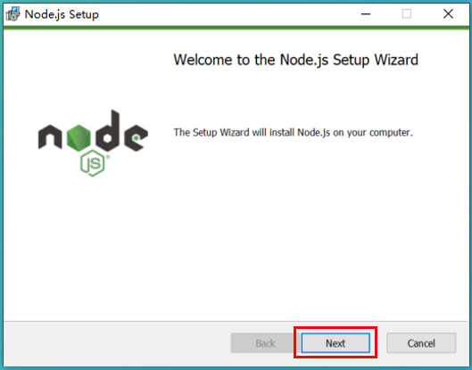
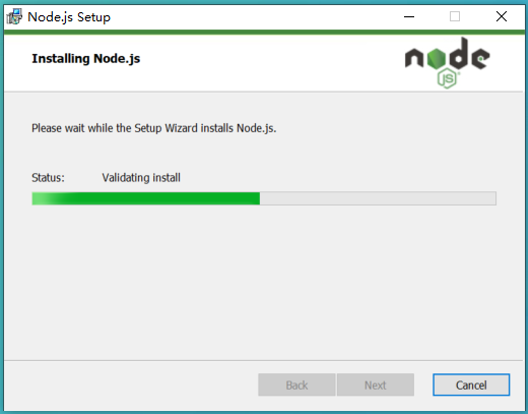
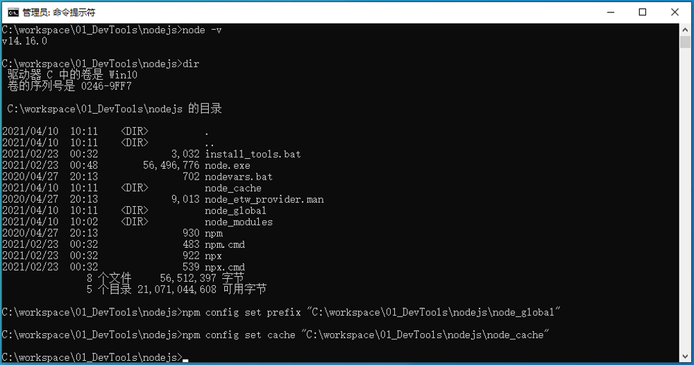

# NodeJS (Windows安装&配置)

## NodeJS的概述
简单的说Node.js就是运行在服务端的JavaScript。Node.js 是一个基于Chrome JavaScript 运行时建立的一个平台。
Node.js是一个事件驱动I/O服务端JavaScript环境，基于Google的V8引擎，V8引擎执行Javascript的速度非常快，性能非常好。

## 从官网下载NodeJS安装文件
```
http://nodejs.cn/download/
```

下载后的安装文件


## 执行安装文件

下一步

下一步

下一步

下一步

下一步

Install

Finish


## 安装后NodeJS的目录


## 配置NodeJS
配置npm的全局模块的存放路径以及cache的路径
在nodejs的目录下面，创建两个文件夹：【node_global】、【node_cache】


启动CMD命令行窗口（以管理员身份启动）


进入nodejs的目录里面，执行下面的命令行
```
npm config set prefix “C:\workspace\01_DevTools\nodejs\node_global”
npm config set cache “C:\workspace\01_DevTools\nodejs\node_cache”
```


安装express模块
```
npm install express -g
```


## 设置NodeJS环境变量
```
设置NODE_PATH
NODE_PATH
C:\workspace\01_DevTools\nodejs\node_global\node_modules
```


```
在Path中添加NodeJS
C:\workspace\01_DevTools\nodejs\node_global
```
就不会出现使用module的时候会导致输入命令出现“xxx不是内部或外部命令，也不是可运行的程序或批处理文件”这个错误。


# End！