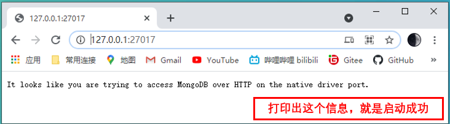

# MongoDB 数据库(Windows安装&配置)

## MongoDB的概述
MongoDB 是一个基于分布式文件存储的数据库。MongoDB 是一个介于关系数据库和非关系数据库之间的产品，是非关系数据库当中功能最丰富，最像关系数据库的。
是文档数据库，存储的是以文档为单位的数据。是Bson数据，Bson是Json的二进制化数据。内部执行引擎为JS解释器，把文档存储成bson结构，转换为JS对象，并可以通过熟悉的JS语法来操作。


## MongoDB数据库与传统关系型数据库
传统关系型数据库：结构化数据，定好了表的结构后，每一行的内容必须符合表结构，也就是说列的个数、类型都固定的。
MangoDB数据库：文档型数据库，表下的每一篇文档，都可以有自己独特的结构（JSON对象都可以有自己独立的属性和值）。

例如：一部电影，有影评、影评的回复、回复的打分
在关系型数据库中，至少需要4张表，关联度非常复杂。
利用MongoDB文档型数据库中，使用一张文档既可以完成。


## 下载安装程序
```
从官方网站下载安装程序
https://www.mongodb.com/try/download/community
```


下载到本地


## 执行安装程序

Next

Next

Next

在C盘根目录下，创建一个MongoDB的文件夹

设置MongoDB的目录

Next

Next

Install


Finish


## 配置MongoDB
在MongoDB下面创创建logs文件夹


创建一个配置文件mongo.conf

添加下记代码，配置MongoDB
```yml
# mongod.conf
# 数据库路径
storage:
  dbPath: C:\Program Files\MongoDB\Server\4.0\data
  journal:
    enabled: true
# 日志输出文件路径、错误日志采用追加模式
systemLog:
  destination: file
  logAppend: true
  path:  C:\Program Files\MongoDB\Server\4.0\log\mongod.log
# 端口号 默认为27017
net:
  port: 27017
  bindIp: 0.0.0.0
# 开启验证功能
security:
  authorization: enabled
```


## 启动MongoDB
启动CMD窗口（以管理员身份启动），进入MongoDB的文件夹


进入MongoDB的目录
```
cd C:\workspace\01_DevTools\MongoDB
```

进入bin文件夹


使用命令行,指定创建的配置文件，启动服务
```
mongod --config “C:\workspace\01_DevTools\MongoDB\mongo.conf” –install –serviceName “MongoDB”
```


## 启动后的确认
通过IE浏览器，访问MongoDB
```
http://127.0.0.1:27017
```


## 命令行操作DB
### 1、连接数据库
在bin目录下，执行mongo命令


### 2、查看数据库
```
show databases；
show dbs;
```


### 3、选择数据库
```
use sample;
```


### 4、查看当前数据库里面的表
```
show tables;
show collections;
```


### 5、获取全部使用命令
```
db.help();
```


### 6、创建数据库
上记命令集中，没有发现数据库的语句。MongoDB是隐式创建数据库.
直接切换一个不存在的数据库。

再创建一个Collection

```
db.createCollection('user');
```


### 7、向user表里面添加数据


### 8、向user表里面添加多条数据
数据放在数组里面就可以
```
db.user.insert([{_id:3,name:'user003',age:30},{_id:4,name:'user004',age:33},{_id:5,name:'user005',age:39}]);
```


### 9、删除user表里面的数据


### 10、修改user表里面的数据


```
db.user.insert([{_id:8,name:'user008',age:30,gender:'m'},{_id:9,name:'user009',age:40,gender:'m'},{_id:10,name:'user010',age:39,gender:'m'}]);
db.user.update({gender:'m'},{$set:{gender:'male'}},{multi:true});
```


```
upsert是指没有配置的行，则直接插入改行
db.user.update({name:'user011'},{$set:{name:'user111'}},{upsert:true});
```

```
$setOnInsert 当upsert为true时，并且发生了insert操作时候，可以补充的字段。
db.user.update({name:'user012'},{$set:{name:'user112'},$setOnInsert:{age:35,gender:'male'}},{upsert:true});
```


### 11、查询user表里面的数据


# End！