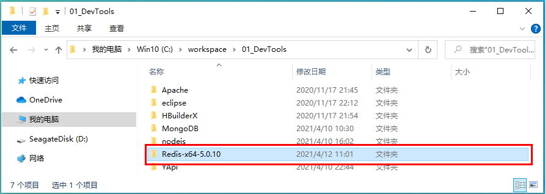
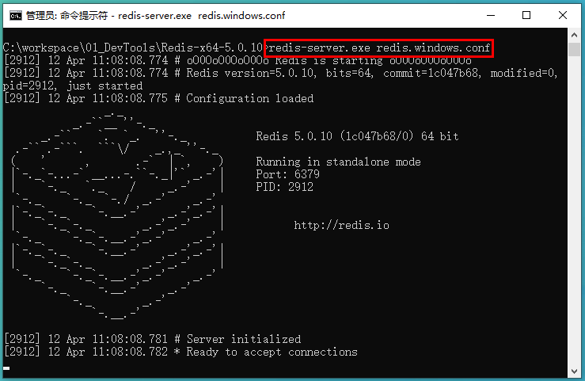
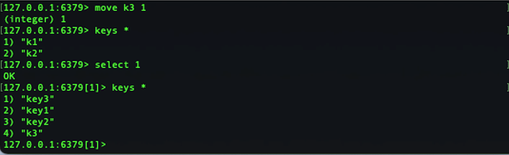

# Redis 数据库(Windows安装&配置)

## NoSQL的概述
NoSQL（Not Only SQL：不仅仅是SQL），泛指非关系型的数据库。Web2.0网站的兴起，传统的关系数据库在应付Web2.0网站，特别是超大规模和高并发的SNS类型的Web2.0纯动态网站已经显得力不从心，暴漏了很多难以克服的问题。非关系型的数据库则由于本身的特点得到非常迅速的发展。NoSQL数据库的产生就是为了解决大规模数据集合多重数据种类带来的挑战，尤其是大数据应用的难题，包括超大数据的存储。泛指经典概念，ACID 原子性一致性 隔离性 持久性

## NoSQL能干什么
1、易扩展
NoSQL数据库种类繁多，有一个共同点就是去掉关系数据的关系型特性。
数据之间没有关联，在架构层面上带来了可扩展的能力。保存数据的方式是「主键 + 值」
  
2、大数据量高性能
NoSQL数据库具有非常高的读写性能，得益于它的无关系性，数据库结构简单。
一般MySQL使用Query Cache，每次表的更新Cache就失败，是一种大颗粒度的Cache。在针对Web2.0交互频繁的应用，Cache性能不高。NoSQL的Cache是记录级的，是一只细颗粒度的Cache，所以NoSQL在这个层面上，性能提高了很多。

3、多样灵活的数据模型
NoSQL无需事先为要存储的数据建立字段，随时可以存储自定义的数据格式。
如果非常大数据量的表，在关系型数据库中，增删字段是一个非常麻烦的事。

4、传统RDMS VS NoSQL
+ RDMS
  + 高度组织化结构化数据
  + 结构化查询语言（SQL）
  + 数据和关系都存储在单独的表中
  + 数据操纵语言，数据定义语言
  + 严格的一致性
  + 基础事物

+ NoSQL
  + 代表着不仅仅是SQL
  + 没有声明性查询语言
  + 没有预定义的模式
  + 键 - 值对存储、列存储、文档存储、图形数据
  + 最终一致性，而非ACID属性
  + 非结构化和不可预知的数据
  + CAP定理（一致性、高可用、分区容错性）
  + 高性能、高可用性、可伸缩性

5、3V + 3高
+ 大数据时代的3V
  + 海量Volume
  + 多样Variety
  + 实时Velocity
+ 互联网需求的3高
  + 高并发
  + 高可扩
  + 高性能

## 什么是Redis
Redis（Remote Dictionary Server：远程字典服务器）
是完全开源免费的，用C语言编写的，遵守BSD协议。是一个高性能的（key/value）分布式内存数据库，基于内存运行、支持持久化的NoSQL服务器。也被人们称数据结构服务器。

## Redis特点
+ Redis支持数据的持久化。可以将内存中的数据保持在磁盘中，重启的时候可以再次加载运行使用。
+ Redis不仅仅支持简单的key-value类型的数据，同时还提供list、set、zset、hash等数据结构。
+ Redis支持数据的备份，即master - slave模式的数据备份。

## Redis可以干什么
内存存储和持久化，radis支持异步将内存中的数据写到硬盘上，同时不影响继续服务，取最新N个数据的操作。可以实现「持久化」、「多数据类型存储」、「备份」。


## Redis下载
从GitHub上面下载widows版的Redis（官网上面建议在Linux使用Redis）
```
https://github.com/tporadowski/redis/releases
```


下载到本地


布置解压后的redis数据库


在环境变量中添加redis路径


## 配置Redis
用文本编辑器打开Redis的配置文件


添加数据库输出日志文件


登录密码的设置（需要的时候再设置即可）


## 启动Redis服务
通过CMD命令提示行（管理员身份启动）窗口，进入redis目录下

执行启动命令
```
redis-server.exe redis.windows.conf
```

==注意：==
刚刚启动的Redis服务，并没有进入Redis数据库。需要另开一个CMD窗口，用于登录数据库。
这个窗口不能关闭，否则Redis的服务就关闭了。

## 登录Redis数据库
通过CMD命令提示行（管理员身份启动）窗口，进入redis目录下
```
redis-cli.exe -h 127.0.0.1 -p 6379
```


## 操作Redis数据库
### 1、数据库的个数
根据配置文件的设置，Redis默认的数据库个是16个。使用select命令来切换数据库
```
select 数据库的号（默认从0开始）
```


### 2、添加数据
```
set 键值 Value值
```


### 3、查看数据库里面有多少个key值
```
dbsize
```


### 4、查看数据库里面所有key值
```
keys *
```


### 5、获取指定key值的value值
```
get key值
```


### 6、模糊查询，“？”的使用
```
get key值字母部分+?
```


### 7、清空当前数据库
```
flushdb
```


### 8、清空全部数据库
```
flushall
```


## Redis数据库的数据类型
### Redis的五大数据类型
+ <font color=red>String（字符串）</font>
是Redis最基本的数据类型，一个key对应一个value。String类型是二进制安全的，Redis的String可以包含任何数据类型，比如jpg图片或者序列化的对象。一个Redis中字符串value最多可以是512M。

+ <font color=red>Hash（哈希，类似Java里面的Map）</font>
是一个键值对集合。是一个String类型的Field和Value的映射表，hash特别适用于存储对象。类似Java里面的Map<String, Object>

+ <font color=red>List（列表）</font>
是一个简单的字符串列表，按照插入顺序，添加一个元素到列表的头部（左边）或者尾部（右边）

+ <font color=red>Set（集合）</font>
是一个String类型的无序集合，通过HashTable实现的。

+ <font color=red>Zset（sorted set：有序集合）</font>
Zset和Set也是String类型元素的集合，且不允许重复的成员。Zset的每一个元素都会关联一个double类型的分数。Redis正是通过分数来为集合中的成员进行从小到大的排序，==Zset的成员是唯一的，但是分数（score）可以重复。==

### Redis 键（Key）：
「keys *」：得到全部的key值

「exists key的名字」：判断某一个Key值是否存在，存在返回「1」、不存在返回「0」

「move key db号码」：将指定的Key值，剪切到指定的db号码中

设置数据的有效时间
「expire key 秒钟」：为给定的Key值设置过期时间
「ttl key」：查看还有多少秒过期。「-1」表示永不过期、「-2」表示已经过期
「type key」：查看Key值是什么类型


### Redis 字符串（String）：
set/get/del/append/strlen

INCR/DECR/INCRBY/DECRBY(一定要是数字才能进行加减)


GETRANGE/SETRANGE


setex(set with expire)键秒值/setnx(set if not exist)


mset/mget/msetnx


### Redis 列表（List）：
LPUSH/RPUSH/LRANGE

LPOP/RPOP

LINDEX 按照索引下标获得元素（从上到下）

LLEN list的长度	

LREM key 删除N个Value值

LTRIM key 开始index 结束index：截取指定范围的之后，再赋值给key

RPOPLPUSH 源列表 目的列表

LSET 键值名 位置 设置的值：把指定list的指定位置的值，变成设定的值

LINSERT 键值名 BEFORE/AFTER 存在的值 插入的值：给指定list里面，从右边查找指定值，在指的前后插入新值


+ 性能总结
List是一个字符串链表，Left、Right都可以插入添加：
如果键值不存在：创建新的链表
如果键值存在：新增内容
如果值被删除：对应的键值就消失
在链表中，无论操作是头元素或者尾元素，效果极高。操作中间元素，效果很惨淡。

### Redis 集合（Set）：
SADD 创建一个Set集合、SMEMBERS 查看Set集合、SISMEMBER 判断元素是否是集合的成员

SCARD 获取集合里面的元素个数

SREM KEY VALUE 删除集合中的元素

SRANDMEMBER KEY 某个整数（随机出几个数）：根据指定的key里面的值，随机生成指定个数值

SPOP KEY 随机出栈：每次随机弹出一个数。

SMOVE KEY1 KEY2 KEY1中的某个值：将KEY1中的某个值迁移到KEY2中

数学结合类：
差集：SDIFF Key1 Key2：在第一个set里面存在，在第二个set中不存在的项目

交集：SINTER Key1 Key2：在两个Set中同时存在的项目

并集：SUNION Key1 Key2：将两个Set合并


### Redis 哈希（Hash）：
hset、hget、hmset、hmget、hgetall、hdel


hlen：获取Hash对象的长度

hexists Key键值 key：在Key键值中对key存在的判断，返回值1是存在，返回值0是不存在

hkeys（获取指定Key所有Key值）/hvals（获取指定Key所有的Value）

hincrby（按照指定的数字增加）/hincrbyfloat（按照指定的小数增加）

hsetnx 指定键值下的value的Key不存在的场合，添加value。返回值1是存在，返回值0是不存在


### Redis 有序集合Zset（sorted set）：
在Set基础上，加一个sore值
Set是：k1 v1 v2 v3
Zset是：k1 score1 v1 score2 v2 score3 v3

ZADD（创建一个Zset对象）、ZRANGE（查询Zset的值）

ZRANGEBYSCORE key 开始score 结束score：


ZREM key 某score下对应的value值：删除某一个元素

ZCARD（得到Zset对象的个数）/ZCOUNT key score区间

ZRANK key values值：获得下标值

ZSCORE key value：得到value对应的score值

ZREVRANK key values值：逆序获得下标值

ZREVRANGE：获取逆序的全部values

ZREVRANGEBYSCORE by score(大) score(小)：从最大值到最小值查询，倒序显示


# End！