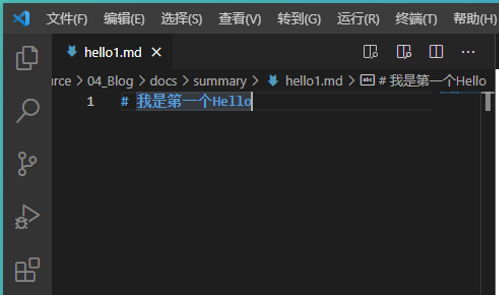

# docsify 文档网站生成工具(Windows安装&配置)

## docsify的概述
经常会写一些项目手册，来记录我们在项目开发过程中的一些开发流程、使用方式以及注意事项，分享给将会使用到这个项目的人，方便大家快速上手，让程序顺利运行。
目前比较好的方式就是写成Markdown格式的技术文档，方便我们发布在github上，同时也可以发布到博客分享平台。除此之外我们还可以借助docsify这个工具，来帮助我们快速的搭建一个小型的文档网站，它可以自动将我们写在Markdown中的标题生成目录，整个页面的配色和布局也十分舒适易读，让整个阅读体验提升了好几个level。

## docsify能干什么
docsify 是一个动态生成文档网站的工具。不同于 GitBook、Hexo 的地方是它不会将 .md 转成 .html 文件，所有转换工作都是在运行时进行。这将非常实用，如果只是需要快速的搭建一个小型的文档网站，或者不想因为生成的一堆 .html 文件“污染” commit 记录，只需要创建一个 index.html 就可以开始写文档而且直接部署在GitHub Pages。

## docsify特性
+ 无需构建，写完文档直接发布
+ 容易使用并且轻量 (~19kB gzipped)
+ 智能的全文搜索
+ 提供多套主题
+ 丰富的 API
+ 支持 Emoji
+ 兼容 IE10+
+ 支持 SSR (example)

## docsify安装
### 1、需要安装NodeJS
查看版本信息


### 2、安装docsify
安装全局安装docsify-cli工具，可以方便创建及本地预览文档网站。
```
npm i docsify-cli -g
```


NodeJS的模板


## 初始化docsify，构建本地网站
在工作目录中，创建一个专门文件夹

从CMD命令行，进去工作文件夹中，执行初期化的命令
```
docsify init docs
```

生成一个docs文件夹

```
index.html：入口文件
README.md：会做为主页内容渲染
.nojekyll：用于阻止 GitHub Pages 会忽略掉下划线开头的文件
```


## 启动本地网站
在初始化的目录（04_Blog）下启动本地服务
```
docsify serve docs
```


## 设置文档网站
### 1、设置封面
修改docs/index.html中设置coverpage: true

创建docs/_coverpage.md文件

编辑md文件
```


# docsify <small>4.12.1</small>

> 一个神奇的文档网站生成器。

- 简单、轻便 (压缩后 ~21kB)
- 无需生成 html 文件
- 众多主题

[GitHub](https://github.com/docsifyjs/docsify/)
[Get Started](#docsify)
```

运行效果


### 2、定制导航栏
#### 2-1、默认加载方式
修改docs/index.html中的<secript>里面，设置loadNavbar: true

创建docs/_navbar.md文件

编辑md文件
```
* 机器学习
  * LR
  * SVM
  * DT
* 深度学习
* NLP
* CV
```

运行效果


#### 2-2、自定义导航栏
修改docs/index.html中的<body>里面，添加导航代码
```
<nav>
  <a href="#/">EN</a>
  <a href="#/zh-cn/">中文</a>
</nav>
```

在docs文件夹中，添加zh-cn文件夹

添加显示的文档内容

运行效果


### 3、定制侧边栏
#### 3-1、自定义导航栏

创建docs/_sidebar.md文件

编辑_sidebar.md文件
```
* [首页](guide)
* [指南](zh-cn/guide)
* [自定义加载的文件](summary)
```

创建【首页】指定的guide.md文件（在docs的根目录下）

添加文字

创建【指南】指定的guide.md文件（在zh-cn的文件夹下创建）

添加文字

运行效果


#### 3-2、自定义侧边栏

创建一个summary的文件夹

创建一个guide.md文件

编写guide.md文件，链接多个md文件


编写hello1和hello2的md文件



向yapi文件夹中添加文件（之前编辑完成的md拷贝这里即可，再修改文件名）

运行效果


# End！