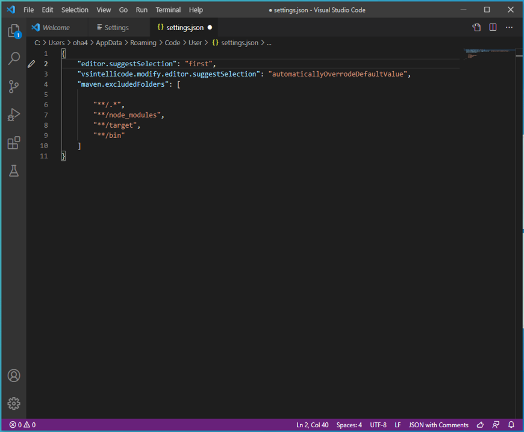

# Visual Studio Code 集成Java开发(Windows安装&配置)

## 从官网下载Visual Studio Code的安装程序
```
https://code.visualstudio.com/
```


下载本地的安装程序


## 执行安装程序，根据安装提示，安装程序即可

## 安装Visual Studio Code需要的插件

### 安装中文语言包插件
打开插件市场，在插件市场中检索
```
插件包：Chinese (Simplified) Language Pack for Visual Studio Code
```

安装后的菜单都变成了中文


### 安装Markdown编写插件
```
插件包：
1、markdown-all-in-one
   所有需要写Markdown要用到的（键盘快捷方式，目录，自动预览等）
2、Markdown Preview Enhanced
   是一款为 Atom 以及 Visual Studio Code 编辑器编写的超级强大的 Markdown 插件。 这款插件意在让你拥有飘逸的 Markdown 写作体验。
3、Markdown pdf
   将Markdown文档转换成PDF文件
```


### 安装Java开发的插件
```
Java Extension Pack
Debugger for Java
Language Support for Java(TM) by Red Hat
```


### 安装Spring开发的扩展包
打开插件市场里面，检索Spring即可
```
Spring Boot Tools
Spring Initializr Java Support
Spring Boot Dashboard
Spring Boot Extension Pack
```


## 配置Visual Studio Code程序
1、配置Maven
点击左下角的齿轮图标，打开【Settings】设置画面




配置Maven的本地信息
```json
{
    "workbench.iconTheme": "vscode-icons",
    "workbench.startupEditor": "newUntitledFile",
    "java.errors.incompleteClasspath.severity": "ignore",
    "workbench.colorTheme": "Atom One Dark",
    "java.home":"C:\\Program Files\\Java\\jdk-15.0.2",
    "java.configuration.maven.userSettings": "C:\\Apache\\apache-maven-3.6.3\\conf\\settings.xml",
    "maven.executable.path": "C:\\Apache\\apache-maven-3.6.3\\bin\\mvn.cmd",
    "maven.terminal.useJavaHome": true,
    "maven.terminal.customEnv": [
        {
            "environmentVariable": "JAVA_HOME",
            "value": "C:\\Program Files\\Java\\jdk-15.0.2"
        }
    ],
}
```
# End！