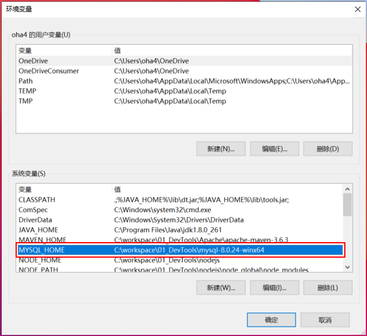
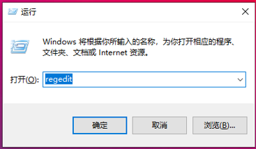

# MySQL 安装及配置

## 从官网下载MySQL的安装程序
```
https://dev.mysql.com/downloads/
```
选择【MySQL Community Server】


选择【Windows(x86,64-bit),ZIP Archive】压缩版


直接下载即可


下载完成，本地程序包


## 配置本地MySQL程序包
1、解压程序包（mysql-8.0.24-winx64.zip）


2、将解压后的文件夹，移动到自己工作的目录下


3、创建一个配置文件【mysql.ini】

```ini
添加下面的设置信息
[mysqld]
#设置3306端口
port = 3306 
# 设置mysql的安装目录
basedir=C:\workspace\01_DevTools\mysql-8.0.24-winx64
# 设置mysql数据库的数据的存放目录
datadir=C:\workspace\01_DevTools\mysql-8.0.24-winx64\data
# 跳过验证
skip-grant-tables
```


5、配置环境变量
右击【我的电脑 --> 属性 --> 高级系统设置】


打开【环境变量】


5-1、在系统变量栏中，点击【新建(W)...】


添加一个MYSQL_HOME变量
```
MYSQL_HOME
C:\workspace\01_DevTools\mysql  # 自己mysql保存的根目录
```




5-2、找到Path变量，点击【编辑(I)...】


点击【新建(N)...】


添加一个属性【%MYSQL_HOME%\bin】


## 启动MySQL服务
1、用管理员身份启动命令行窗口


2、进入mysql的bin文件夹


3、初期化mysql
```
mysqld --initialize
```


4、生成一个data的文件夹


5、找到【xxxx.err】文件，用编辑器打开


6、输入【mysqld --install】命令，完成MySQL的 初始化
```
mysqld --install
```


7、输入【net start mysql】命令，启动MySQL服务。停止命令【net stop mysql】
```
启动：net start mysql
停止：net stop mysql
```


8、使用root用户登录MySQL
```
mysql -u root -p
```


登录成功提示符变成mysql


9、修改root的初期密码
因为第一次使用，没有修改密码，登录数据库发生异常信息


使用Alert命令，修改密码。<font color="#ff0000">zaq12wsx</font>是新密码
```
alter user 'root'@'localhost' identified by 'zaq12wsx';
```


退出当前登录


10、利用新密码再次登录


11、使用mysql数据库，查看mysql下面的所有表格
```
use mysql;
show tables;
```


## 卸载本地安装的MySQL
1、停止数据库服务
```
net stop mysql
```


2、删除数据库服务
```
sc delete mysql
```


3、从注册表删除MySQL

```
路径1：\HKEY_LOCAL_MACHINE\SYSTEM\ControlSet001\services\eventlog\Application\MySQL
路径2：\HKEY_LOCAL_MACHINE\SYSTEM\ControlSet002\services\eventlog\Application\MySQL
```
删除整个MySQL文件夹即可

# End！