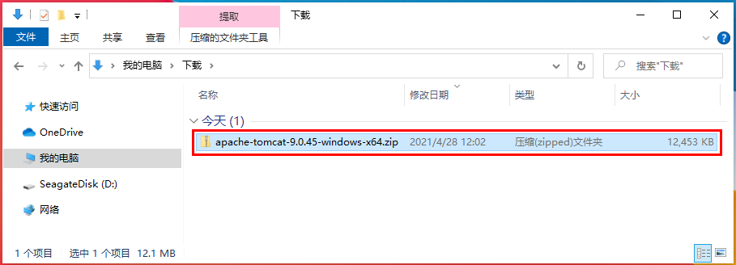
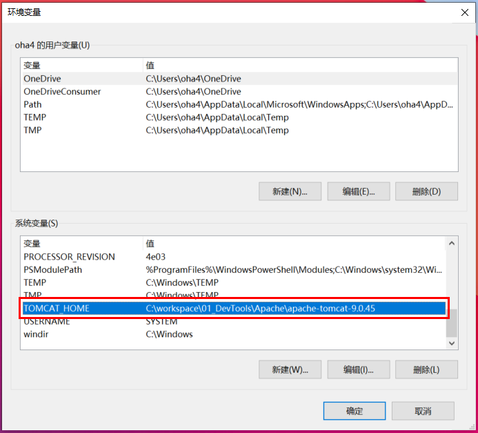
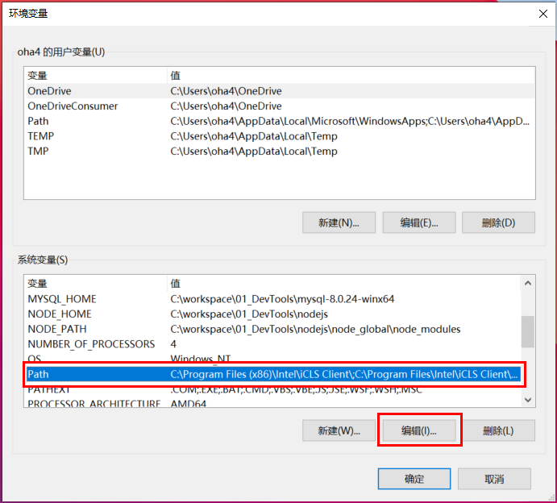
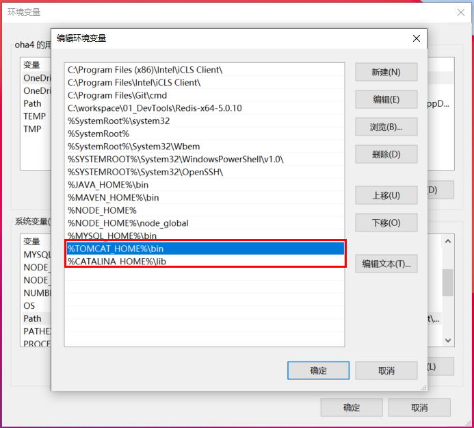
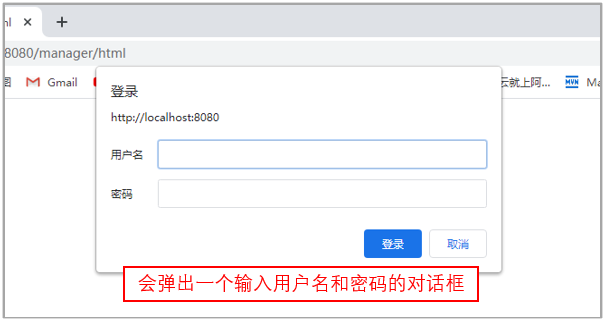
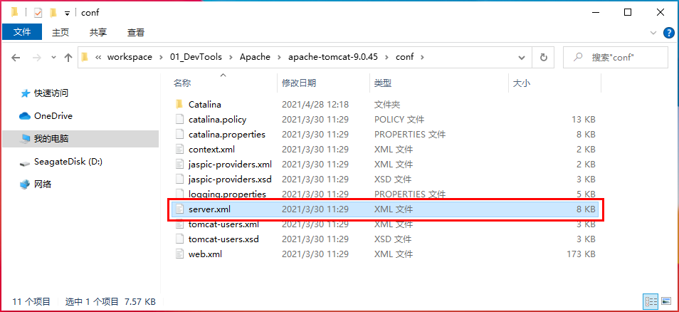

# Tomcat 安装、配置、war的部署

### 从官网下载Tomcat的程序包
```
http://tomcat.apache.org/
```
选择【Tomcat 9】


下载到本地【apache-tomcat-9.0.45-windows-x64.zip】


解压，放进工作目录下面


```
目录结构组成:
  bin：目录存放一些启动运行Tomcat的可执行程序和相关内容。
  conf：存放关于Tomcat服务器的全局配置。
  lib：目录存放Tomcat运行或者站点运行所需的jar包，所有在此Tomcat上的站点共享这些jar包。
  logs： 存放日志文件，用于每次tomcat运行后的日志
  temp:  存放临时文件
  wabapps：目录是默认的站点根目录，自动部署web应用，将web应用复制到此目录，tomcat会将该应用自动部署到容器
  work：简单来说，就是存储jsp、servlet翻译、编译后的结果
```
### 配置环境变量
1、打开Windows的环境变量设置页面


2、打开设置页面


3、添加全局变量TOMCAT_HOME
```
TOMCAT_HOME
C:\workspace\01_DevTools\Apache\apache-tomcat-9.0.45
```




4、添加全局变量CATALINA_HOME，值与TOMCAT_HOME相同
```
CATALINA_HOME
C:\workspace\01_DevTools\Apache\apache-tomcat-9.0.45
```


5、修改Path变量
编辑Path

新建环境变量值

添加两个环境变量
```
%TOMCAT_HOME%\bin
%CATALINA_HOME%\lib
```


### 启动、关闭Tomcat
1、启动CMD窗口，利用管理员身份启动


2、进入bin文件夹下
```
cd C:\workspace\01_DevTools\Apache\apache-tomcat-9.0.45\bin
```


3、输入service.bat install（输入service.bat remove可以移除注册服务）
```
service.bat install
```


4、启动Tomcat
```
net start Tomcat9
```


5、访问Tomcat控制台
```
http://localhost:8080
```


6、关闭Tomcat
```
net stop Tomcat9
```


### 部署Web应用的配置
1、自动部署
1-1、将生成war包拷贝到%TOMCAT_HOME%\webapps下面


1-2、重新启动Tomcat，加载war程序


1-3、在浏览器中访问Web应用程序
```
http://localhost:8080/HelloWorld-0.0.1-SNAPSHOT/hello
```


2、控制台部署
2-1、进入Tomcat管理控制台


需要输入用户名和密码


2-2、设置登录Tomcat管理控制台的用户名和密码


2-3、使用是设置的用户名和密码，重新登录


2-4、Tomcat控制台页面


2-5、在【要部署的WAR文件】栏中


2-6、选择需要上传的war文件


2-7、在浏览器中访问Web应用程序


### 其他的配置
1、解决中文乱码

打开配置文件
%TOMCAT_HOME%\conf\server.xml中Connector标签下指定URIEncoding的值为"UTF-8"
```
URIEncoding="UTF-8"
```


2、配置虚拟目录
通过Maven打成war的时候，war包的名称会是【项目.版本.SNAPSHOP】
发布Web程序放到webapps中可以配置虚拟目录，否则访问时候加上 项目.版本.SNAPSHOP就麻烦了

第一步：将生成的war包拷贝到webapps中


第二步：配置地址
%TOMCAT_HOME%\conf\server.xml中host下，这样访问的时候helloworld就相当于虚拟目录



重新启动Tomcat，加载war程序


在浏览器中访问Web应用程序


3、设置自定义错误页面

第一步：%TOMCAT_HOME%\conf\web.xml中web-app节点中配置错误页面


第二步：%TOMCAT_HOME%\webapps\ROOT下，创建一个【error_404.html】错误页面


编写error_404.html页面
```html
<!DOCTYPE html>
<html>
    <head>
        <meta charset="utf-8">
        <title>404 无法找到访问文件</title>
    </head>
    <body>
        尊敬的朋友，后台服务器有问题，工程师们正在努力抢修中，请稍后访问......
    </body>
</html>
```

访问一个不存在的地址


# End！