# Apache 安装、配置、html资源部署

### 概要
1、Apache 介绍
Apache HTTP Server（简称Apache）是Apache软件基金会的一个开放源码的网页服务器，是世界使用排名第一的Web服务器软件，可以在大多数计算机操作系统中运行，由于其多平台和安全性被广泛使用，是最流行的Web服务器端软件之一。

2、Apache与Tomcat的区别
Apache是Web服务器，和它类似的还有常说的Nginx，而Tomcat是应用服务器，更明确地说Tomcat只是一个servlet容器，可以认为它是Apache的扩展，但是可以独立于Apache运行。
* 两者的相同点：
  1. 两者都是Apache组织开发的
  2. 两者都有HTTP服务的功能
  3. 两者都是开源免费的
  4. 两者都可以独立运行

* 两者的不同点：
  1. Apache只是一个普通服务器，只能用来解析静态页面（html），不支持解析动态页面（jsp），它可以通过插件支持php。如果想解析动态页面（jsp）就要用到Tomcat，Tomcat同时也支持HTML、JSP、ASP、PHP、CGI等。
  2. Apache是用C语言实现的，支持各种特性和模块从而来扩展核心功能，而Tomcat是用Java实现的，所以它更好的支持jsp。
  3. 一般使用Apache+Tomcat的话，Apache直接处理静态请求而不经过Tomcat，对于动态请求，Apache只是作为一个转发，对jsp的处理是由Tomcat来处理的，Apache回传解析好的静态代码，这样整合就可以减少Tomcat的服务开销。 
  4. Apache可以单向与Tomcat连通，就是说通过Apache可以访问Tomcat资源，反之不然。
  5. Apache是很最开始的页面解析服务，Tomcat是后研发出来的，从本质上来说Tomcat的功能完全可以替代Apache，但Apache毕竟是Tomcat的前辈级人物，并且市场上也有不少人还在用Apache，Apache虽然不能解析Java的东西，但解析html速度快，所以Apache还会继续存在，不会被取代。
  6. Apache可以运行一年不重启，稳定性非常好，而Tomcat则不见得。
  7. 首选web服务器是Apache，但Apache解析不了的jsp、servlet才用Tomcat。
  8. 只使用Apache服务器不需要安装jdk，使用Tomcat服务器必须安装jdk并配置好环境变量。

3、Apache和Tomcat整合的好处
1. 如果客户端请求的是静态页面，则只需要Apache服务器响应请求
2. 如果客户端请求动态页面，则是Tomcat服务器响应请求
3. 因为jsp是服务器端解释代码的，这样整合就可以减少Tomcat的服务开销

### 从官网下载Apache的程序包
```
http://www.apachelounge.com/download/
```
选择【httpd-2.4.46-win64-VS16.zip】
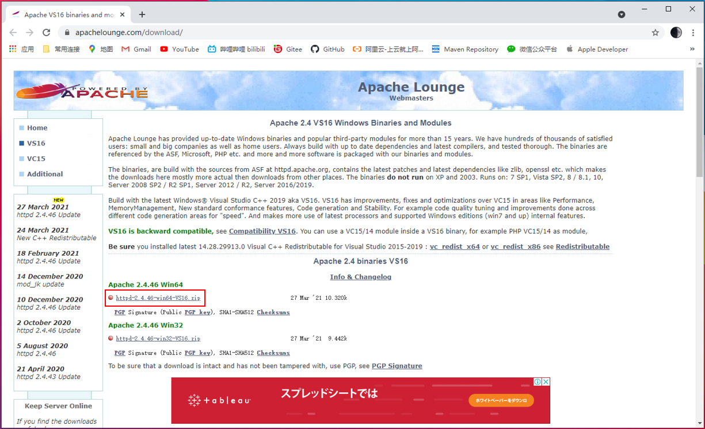

下载到本地【httpd-2.4.46-win64-VS16.zip】
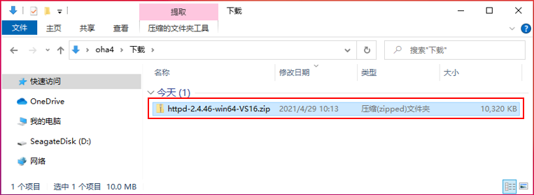

解压，放进工作目录下面
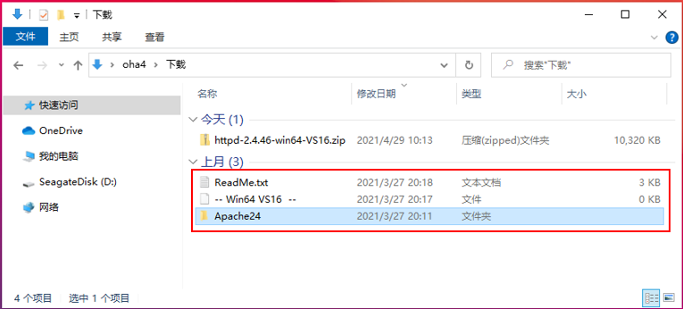

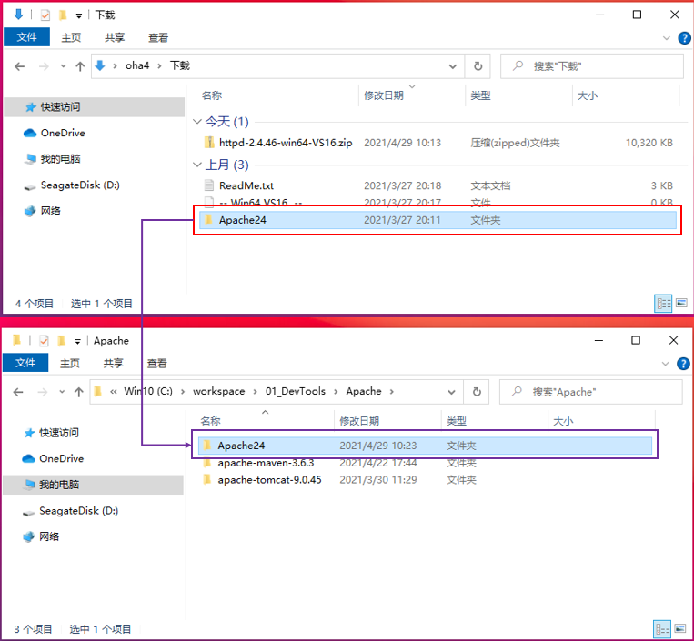

### 修改配置文件
1、修改Apache24\conf\httpd.conf配置文件
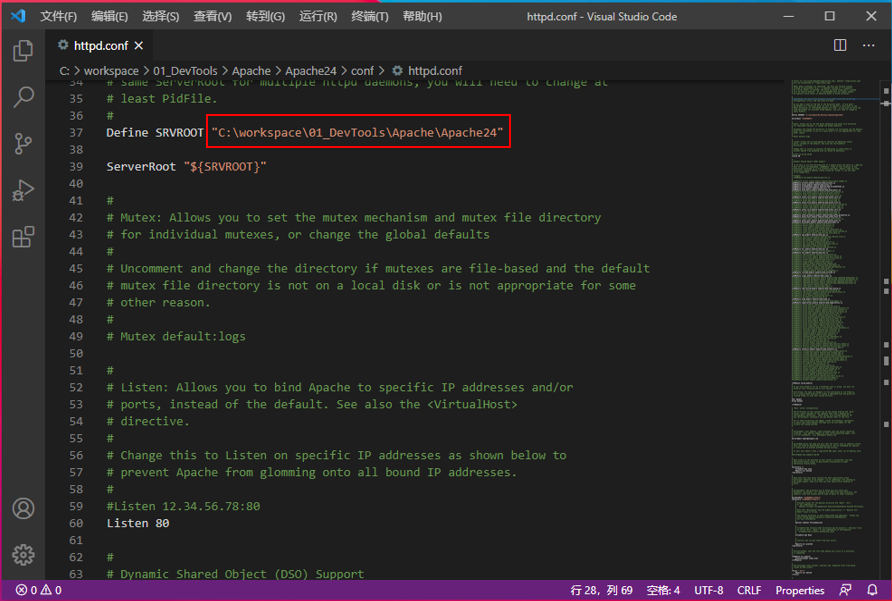

### 启动、关闭Apache
1、使用命令行启动Apache服务
1-1、在CMD窗口下，进入Apache的bin文件夹
```
cd C:\workspace\01_DevTools\Apache\Apache24\bin
```
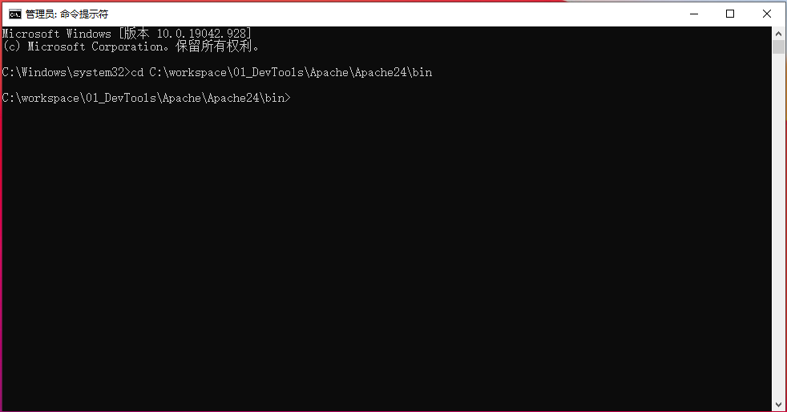

1-2、输入安装命令开始安装服务
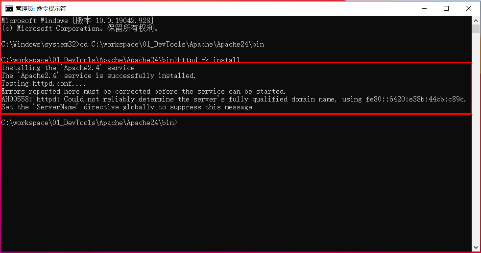
```
httpd -k install
```
弹出安全中心警报提示框，点击【允许访问】即可
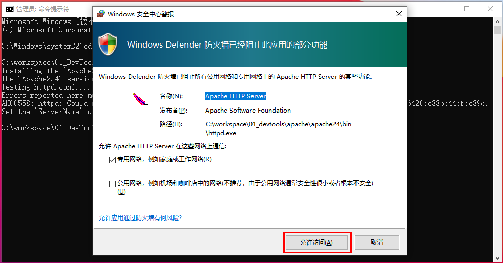

1-3、打开计算机服务
快捷键 ==Win+R== 在运行窗口输入==services.msc==打开服务。
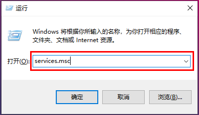

可以看到Apache2.4已经加入了。启动类型为“自动”，每次开机自动运行Apache2.4服务
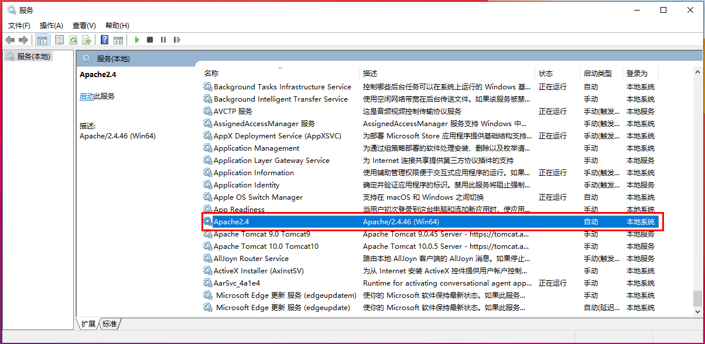

如需卸载开机启动
```
httpd.exe -k uninstall
```

1-4、输入启动命令启动服务
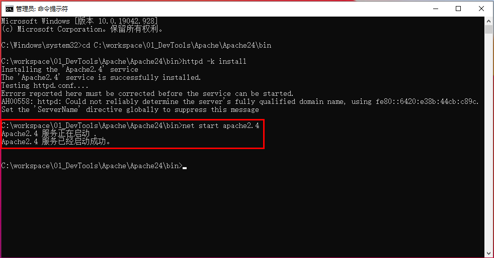

1-5、在浏览器，输入网址访问
```
http://localhost/
```
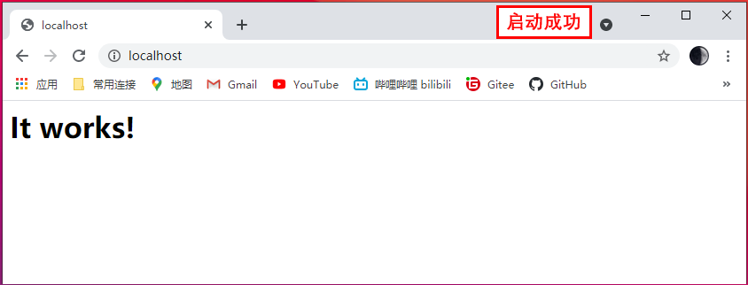

1-6、输入停止命令启动服务
```
net stop apache2.4
```
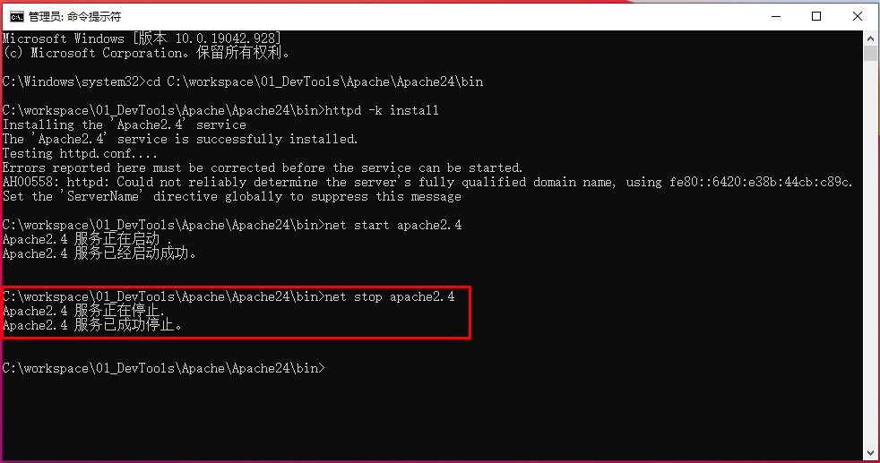

2、可以通过Apache自带的exe程序启动服务
在C:\workspace\01_DevTools\Apache\Apache24\bin下面，执行【ApacheMonitor.exe】
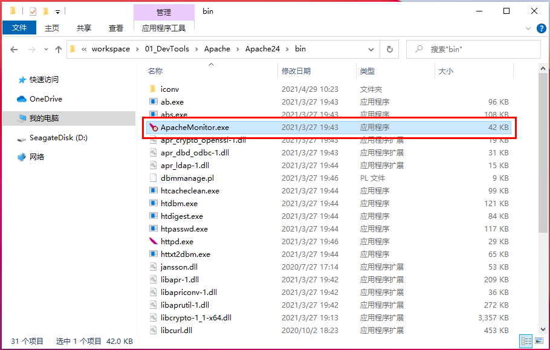

2-1、执行exe文件，在右下角出现apache的图标
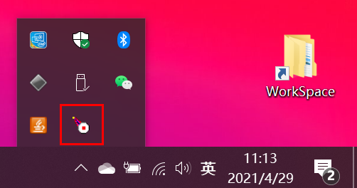

点击【Start】按钮，启动Apache服务
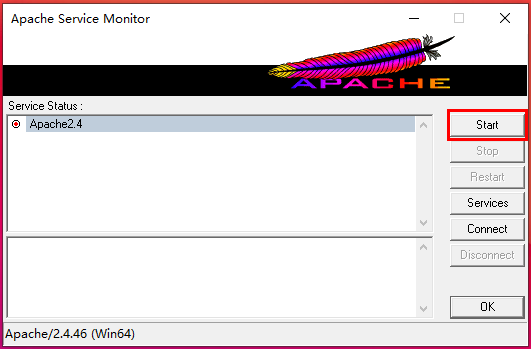

启动成功
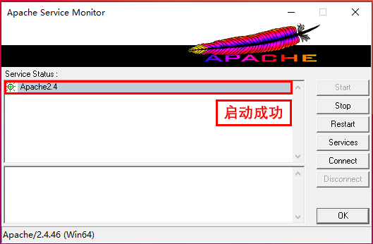

2-2、在浏览器，输入网址访问
```
http://localhost/
```
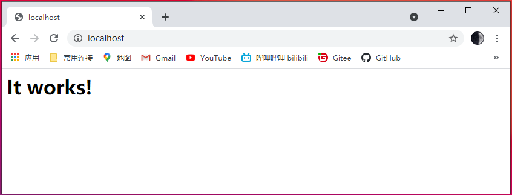

### 布置自己的资源
1、Apache24下面的htdocs文件夹，配置index.html文件
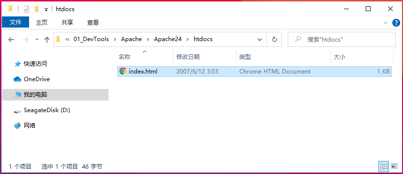
启动成功后，在浏览器中访问http://localhost/，显示的【It works!】就额是这个页面
可以把自己的静态页面，布置在这个文件中，进行访问

2、添加一个hello.html文件
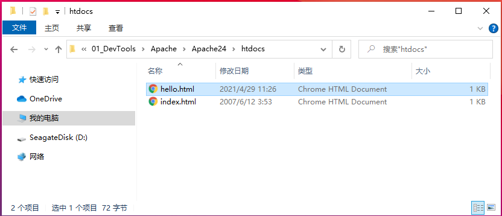

编写页面代码
```html
<html>
    <body>
        <h1>Hello Apache!</h1>
    </body>
</html>
```
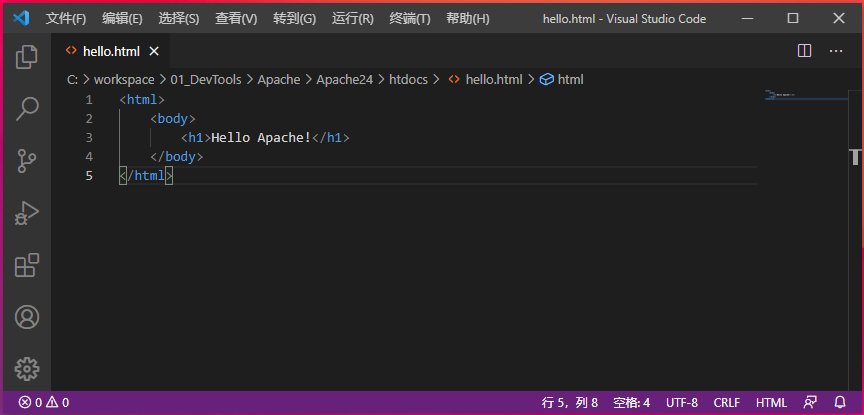

编写完代码后，重启Apache服务。在浏览器中输入地址访问hello.html页面
```
http://localhost/hello.html
```
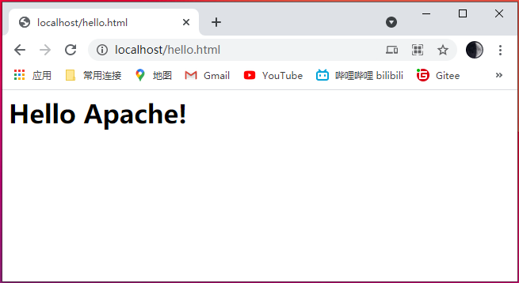

# End！