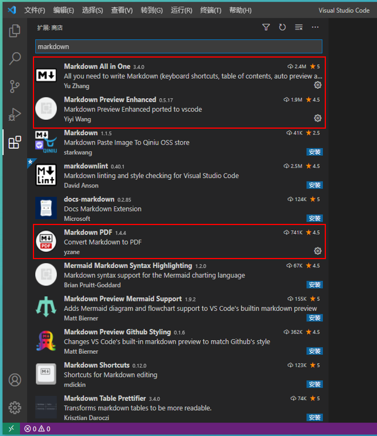

# Markdown 的使用

# 什么是MarkDown
是一种轻量级的标记语言，它允许人们使用易读易写的纯本文格式编写文本。
+ 专注文字内容而不是排版样式，安心编写文档内容。
+ 可以轻松导出HTML、PDF和本事的.md文件。
+ 纯文本内容，兼容所以的文本编辑器与文字处理软件。
+ 随时修改文字版本，不必像文字处理器，生成若干对应的文件版本，导致文件管理的混乱。
+ 可读、直观、学习成本低。

# 编写MarkDown的工具
+ Visual Studio Code（Windows、MacOS）
  + 安装插件
    + markdown-all-in-one
    + Markdown Preview Enhanced
    + Maridown pdf

+ Typora （Windows、MacOS）

# MarkDown的基本语法
## 1、标题
使用#，将文字设置成标题
一个#是一级标题，两个#是二级标题，支持六级标题
语法：# + 空格 + 文字
# 一级标题
## 二级标题
### 三级标题
#### 四级标题
##### 五级标题
###### 六级标题

## 2、文字的字体
加粗：左右**，中间文字。**MarkDown 粗体 写法1**
加粗：左右__，中间文字。__MarkDown 粗体 写法2__
斜体：左右*，中间文字。*MarkDown 斜体 写法1*
斜体：左右_，中间文字。_MarkDown 斜体 写法2_
删除线：左右~~，中间文字。~~MarkDown 删除线~~
高亮显示：左右==，中间文字。==MarkDown 高亮标注==
字体颜色：使用font标签里面设置color属性。<font color="#008000">MarkDown 字体颜色</font>
字体样式：使用font标签里面设置face属性。<font face="华文彩云">MarkDown 字体颜色</font>
字体字号：使用font标签里面设置size属性，字号值：1~7，默认字号3。<font size="5">MarkDown 5号字</font>

## 3、文字的引用
在文字的前面添加符号>，可以多层嵌套两个>、三个>
>第一层：这里使用的是文字引用
>>第二层：这里使用的是文字引用
>>>第三层：这里使用的是文字引用

## 4、分割线
使用三个或者三个以上的-、三个或者三个以上的*，表示分割线。

---
----
***
****

## 5、导入图片
语法：
1.图片alt:可以设置空值
2.图片地址：本地地址、网络地址
本地地址：相对路径（./images/image001.png（images和.md文件同级目录））
网络地址：https://ss0.bdstatic.com/70cFvHSh_Q1YnxGkpoWK1HF6hhy/it/u=702257389,1274025419&fm=27&gp=0.jpg
3.图片title:可以设置空值


## 6、超链接
语法：[超链接名](超链接地址 + 空格 + "超链接title")
超链接地址：本地地址、网络地址
本地地址：本地路径的相对路径、绝对路径都可以
网络地址：http://www.baidu.com
+ [本地路径 Windwos 10 NodeJS 配置](summary/01_NodeJS/guide)
+ [网络路径 百度](http://www.baidu.com)

## 7、列表
无序列表用 - + * 任何一种都可以，符号跟文字内容之间要有一个空格
- 列表文字内容，使用【-】
+ 列表文字内容，使用【+】
* 列表文字内容，使用【*】
  
有序列表用 数字加点，【序号.】跟文字内容之间要有一个空格
1. 列表文字内容，使用【1.】
2. 列表文字内容，使用【2.】
3. 列表文字内容，使用【3.】

列表嵌套 上一级和下一级之间敲三个空格即可
+ 一级无序列表内容
   + 二级无序列表内容
   + 二级无序列表内容
   + 二级无序列表内容

+ 一级无序列表内容
   1. 二级无序列表内容
   2. 二级无序列表内容
   3. 二级无序列表内容

1. 一级无序列表内容
   + 二级无序列表内容
   + 二级无序列表内容
   + 二级无序列表内容

1. 一级无序列表内容
   1. 二级无序列表内容
   2. 二级无序列表内容
   3. 二级无序列表内容

## 7、表格
```
表头|表头|表头
---|:--:|---:
内容|内容|内容
内容|内容|内容

第二行分割表头和内容。
- 有一个就行，为了对齐，多加了几个
文字默认居左
-两边加：表示文字居中
-右边加：表示文字居右
注：原生的语法两边都要用 | 包起来。此处省略
```
姓名|技能|排行
--|:--:|--:
刘备|哭|大哥
关羽|打|二哥
张飞|骂|三弟

## 8、代码块
单行代码：代码之间用一个反引号包起来
`代码内容create database hero;`
多行代码：代码之间用三个反引号包起来，三个反引号，单独占一行。
```
# 多行代码
function fun(){
  echo "这是一句非常牛逼的代码";
}
fun();
```

## 9、流程图
```
# ```flow
# st=>start: 开始
# op=>operation: My Operation
# cond=>condition: Yes or No?
# e=>end
# st->op->cond
# cond(yes)->e
# cond(no)->op
# &```
```
运行效果：
```flow
st=>start: 开始
op=>operation: My Operation
cond=>condition: Yes or No?
e=>end
st->op->cond
cond(yes)->e
cond(no)->op
&```


# End