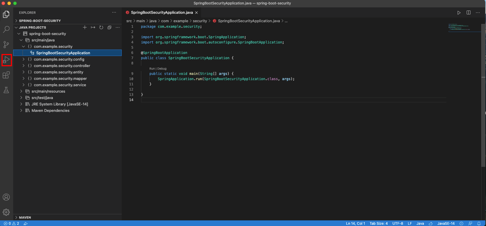
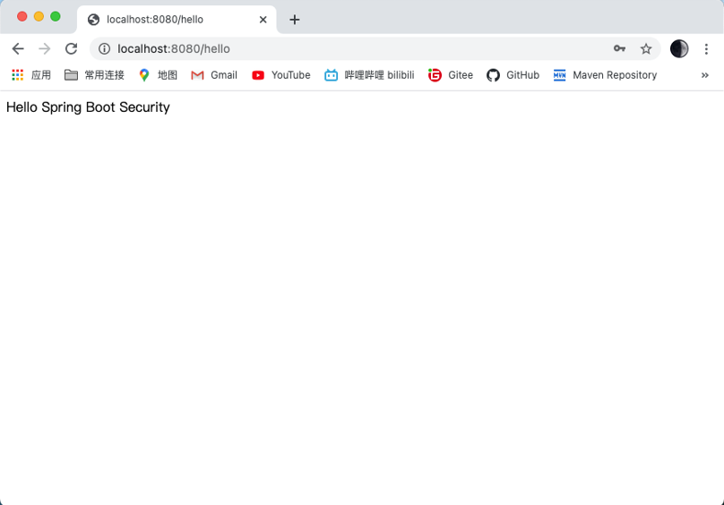

# SpringBoot + Security + MySQL 登录认证

## 第一步：设置开发工具
使用Visual Studio Code进行开发
在 Visual Studio Code 中打开扩展视图（按【Ctrl+Shift+X】）


+ 安装Java插件
  + 安装插件
    + Java Extension Pack
    + Debugger for Java
    + Language Support for Java(TM) by Red Hat


+ 安装Spring开发插件STS
   + 安装插件
     + Spring Boot Extension Pack	


## 第二步：配置Maven
进入配置页面，点击左下角的齿轮ico，选择Settings


在搜素栏里面输入【maven】，执行Edit it settings.json


添加下面的设置内容
```json
{
    "workbench.iconTheme": "vscode-icons",
    "workbench.startupEditor": "newUntitledFile",
    "java.errors.incompleteClasspath.severity": "ignore",
    "workbench.colorTheme": "Atom One Dark",
    "java.home":"C:\\Program Files\\Java\\jdk-15.0.2",
    "java.configuration.maven.userSettings": "C:\\Apache\\apache-maven-3.6.3\\conf\\settings.xml",
    "maven.executable.path": "C:\\Apache\\apache-maven-3.6.3\\bin\\mvn.cmd",
    "maven.terminal.useJavaHome": true,
    "maven.terminal.customEnv": [
        {
            "environmentVariable": "JAVA_HOME",
            "value": "C:\\Program Files\\Java\\jdk-15.0.2"
        }
    ],
}
```


## 第三步：创建SpringBoot + SpringSecurity项目
使用快捷键(Ctrl+Shift+P)命令窗口，输入 【Spring Initializr】选择创建 Maven 项目


选择SpringBoot的版本


选在Java开发语言


创建一个GroupId


设置ArtifactId（项目工程名）


设置打包类型（生成jar包）


选在Java的版本号


选择开发依赖模块
```
- Thymeleaf
- Spring Web
- Spring Security
- MyBatis Framework
- MySQL
```


选择工程的保存位置


项目创建成功，使用SpringInitializr打开项目


选择Yes


生成一个标准的Spring工程项目


## 第四步：在MySQL中创建验证用的用户表
建表命令
```sql
SET NAMES utf8mb4;
SET FOREIGN_KEY_CHECKS = 0;
-- ----------------------------
-- Table structure for user
-- ----------------------------
DROP TABLE IF EXISTS `user`;
CREATE TABLE `user` (
   `id` int NOT NULL AUTO_INCREMENT,
   `username` varchar(255) DEFAULT NULL,
   `password` varchar(255) DEFAULT NULL,
   PRIMARY KEY (`id`)
) ENGINE=InnoDB AUTO_INCREMENT=2 DEFAULT CHARSET=utf8mb4 COLLATE=utf8mb4_0900_ai_ci;

SET FOREIGN_KEY_CHECKS = 1;
```


添加一条测试数据
```sql
-- ----------------------------
-- Records of user
-- ----------------------------
BEGIN;
INSERT INTO `user` VALUES (1, 'admin', '123456');
COMMIT;
```


## 第五步：编写Java代码
项目工程的结构


### 创建Controller类，接收浏览器发出的hello请求
```java
package com.example.security.controller;

import org.springframework.web.bind.annotation.GetMapping;
import org.springframework.web.bind.annotation.RestController;

@RestController
public class HelloController {
    
    @GetMapping(value = "hello")
    public String sayHello() {
        return "Hello Spring Boot Security";
    }
}
```


### 创建对象的UserEntity对象类
```java
package com.example.security.entity;

public class UserEntity {
    
    private Integer id;
    private String username;
    private String password;

    public Integer getId() {
        return id;
    }

    public void setId(Integer id) {
        this.id = id;
    }

    public String getUsername() {
        return username;
    }

    public void setUsername(String username) {
        this.username = username;
    }

    public String getPassword() {
        return password;
    }

    public void setPassword(String password) {
        this.password = password;
    }   
}
```


### 创建UserMapper接口类
```java
package com.example.security.mapper;

import com.example.security.entity.UserEntity;

import org.apache.ibatis.annotations.Mapper;
import org.apache.ibatis.annotations.Select;

@Mapper
public interface UserMapper {
    
    /**
     * 根据用户名查询数据
     */
    @Select("select id, username, password from user where username=#{userName}")
    UserEntity findByName(String username);
}
```


### 创建「SecurityConfig」配置类，继承「WebSecurityConfigurerAdapter」
```java
package com.example.security.config;

import org.springframework.beans.factory.annotation.Autowired;
import org.springframework.context.annotation.Configuration;
import org.springframework.security.config.annotation.authentication.builders.AuthenticationManagerBuilder;
import org.springframework.security.config.annotation.web.configuration.WebSecurityConfigurerAdapter;
import org.springframework.security.core.userdetails.UserDetailsService;
import org.springframework.security.crypto.bcrypt.BCryptPasswordEncoder;

@Configuration
public class SecurityConfig extends WebSecurityConfigurerAdapter {
    
    @Autowired
    private UserDetailsService userDetailsService;

    /**
     * 实现用户身份认证
     */
    @Override
    protected void configure(AuthenticationManagerBuilder auth) throws Exception{
        // 定义一个加密对象
        BCryptPasswordEncoder encoder = new BCryptPasswordEncoder();
        // 设置自定义的UserDetailsService实现类
        auth.userDetailsService(userDetailsService).passwordEncoder(encoder);
    }
}
```


### 创建「MyUserDetailsService」逻辑类，继承「WebSecurityConfigurerAdapter」
```java
package com.example.security.service;

import java.util.List;

import com.example.security.entity.UserEntity;
import com.example.security.mapper.UserMapper;

import org.springframework.beans.factory.annotation.Autowired;
import org.springframework.security.core.GrantedAuthority;
import org.springframework.security.core.authority.AuthorityUtils;
import org.springframework.security.core.userdetails.User;
import org.springframework.security.core.userdetails.UserDetails;
import org.springframework.security.core.userdetails.UserDetailsService;
import org.springframework.security.core.userdetails.UsernameNotFoundException;
import org.springframework.security.crypto.bcrypt.BCryptPasswordEncoder;
import org.springframework.stereotype.Service;
import org.springframework.util.ObjectUtils;

@Service("userDetailsService")
public class MyUserDetailsService implements UserDetailsService {

    @Autowired
    private UserMapper userMapper;

    @Override
    public UserDetails loadUserByUsername(String username) throws UsernameNotFoundException {
        // 参数「username」是页面表单提交过来的数据，就是页面的用户名
        // 利用UserMapper里面的查询方法，获取User表里面的数据
        UserEntity userEntity = userMapper.findByName(username);

        // users等于null的时候，该当用户不存在，认证失败
        if (ObjectUtils.isEmpty(userEntity)) {
            throw new UsernameNotFoundException(username + " 不存在，请重新输入。");
        }

        // 设置一个角色授权
        List<GrantedAuthority> auths =
                AuthorityUtils.commaSeparatedStringToAuthorityList("admin");
                
        // 设定登录的用户名、设定数据库User表中的密码、添加一个用户权限
        return new User(username, new BCryptPasswordEncoder().encode(userEntity.getPassword()), auths);
    }
}
```


### 创建「application.properties」配置文件，添加DataSource，链接数据库
```properties
# DB Configuration
spring.datasource.driver-class-name=com.mysql.cj.jdbc.Driver
spring.datasource.url=jdbc:mysql://localhost:3306/koguro?characterEncoding=utf-8&serverTimezone=GMT%2B8
spring.datasource.username=root
spring.datasource.password=zaq12wsx
```

## 第六步：启动主程序类，进行测试
### 启动SpringBoot主程序类：


点击Run按钮


成功启动Spring服务


### 通过IE页面访问，进行测试
```
访问
http://localhost:8080/hello
```


#### 输入正确的用户名和密码

点击Sing in按钮


#### 输入错误的密码

点击Sing in按钮
