# SpringBoot + Dom4j 解析XML文件

## 第一步：创建Spring工程
使用快捷键(Ctrl+Shift+P)命令窗口，输入 【Spring Initializr】选择创建 Maven 项目
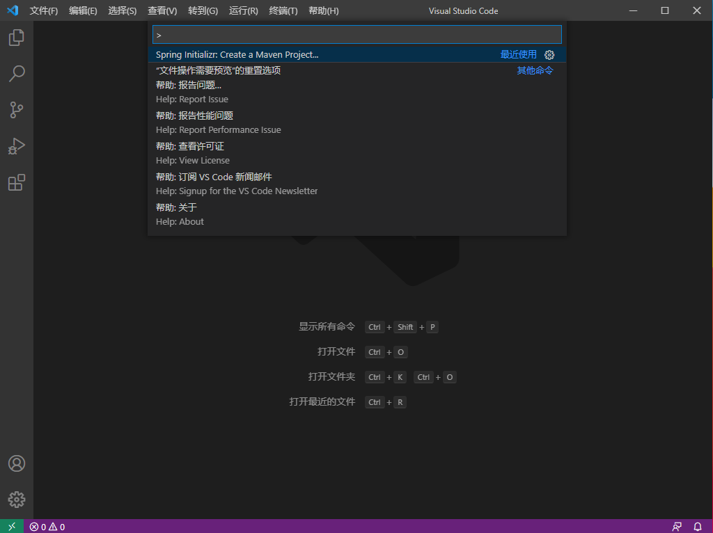

选择SpringBoot的版本
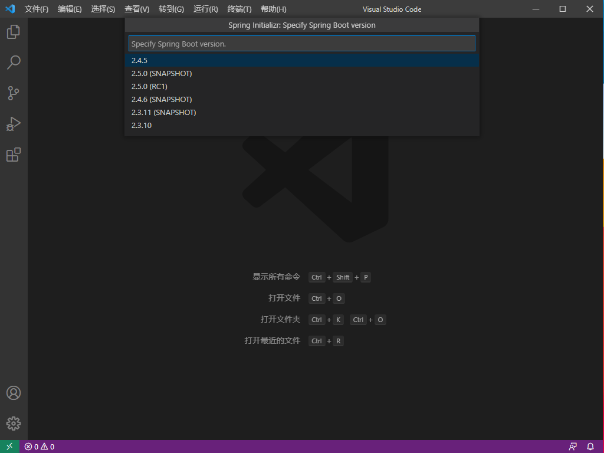

选在Java开发语言
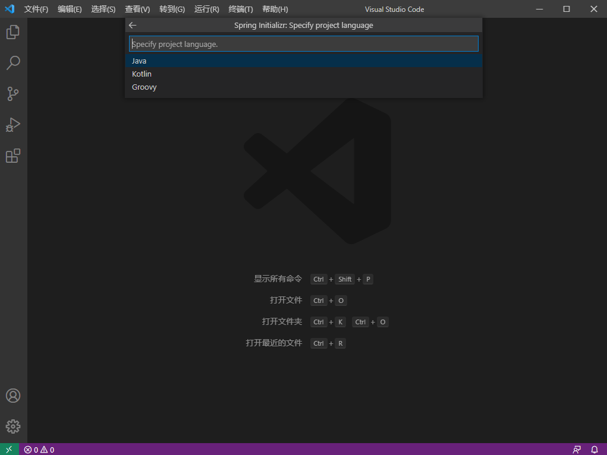

创建一个GroupId
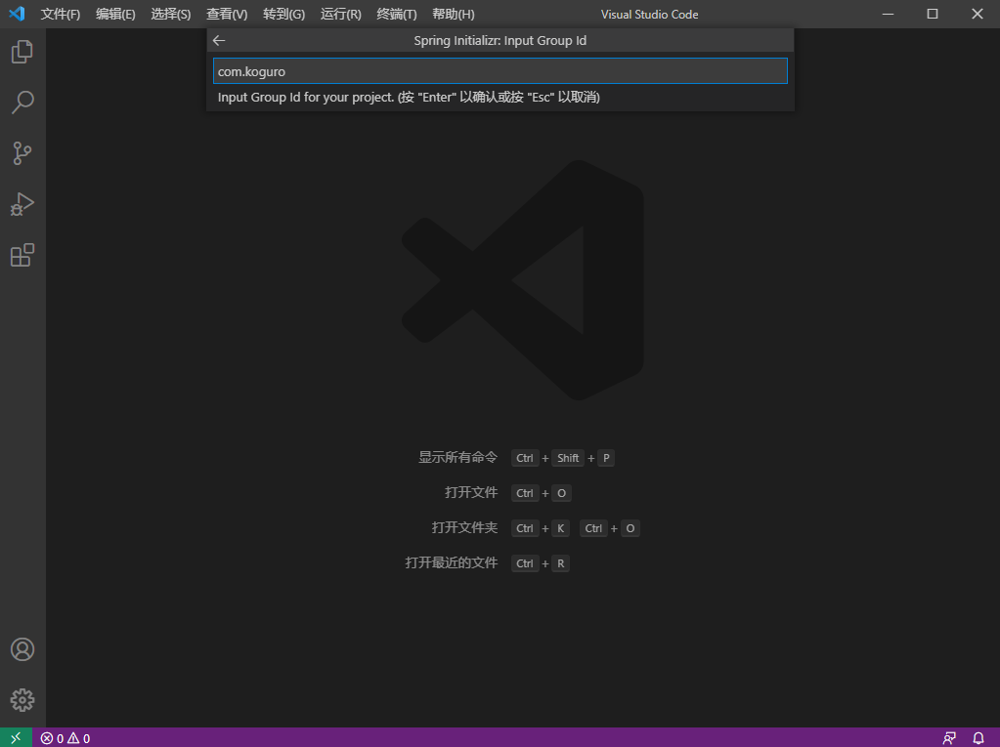

设置ArtifactId（项目工程名）


设置打包类型（生成jar包）
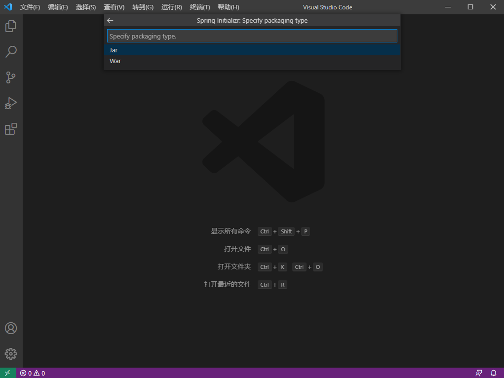

选在Java的版本号(使用Java 8)
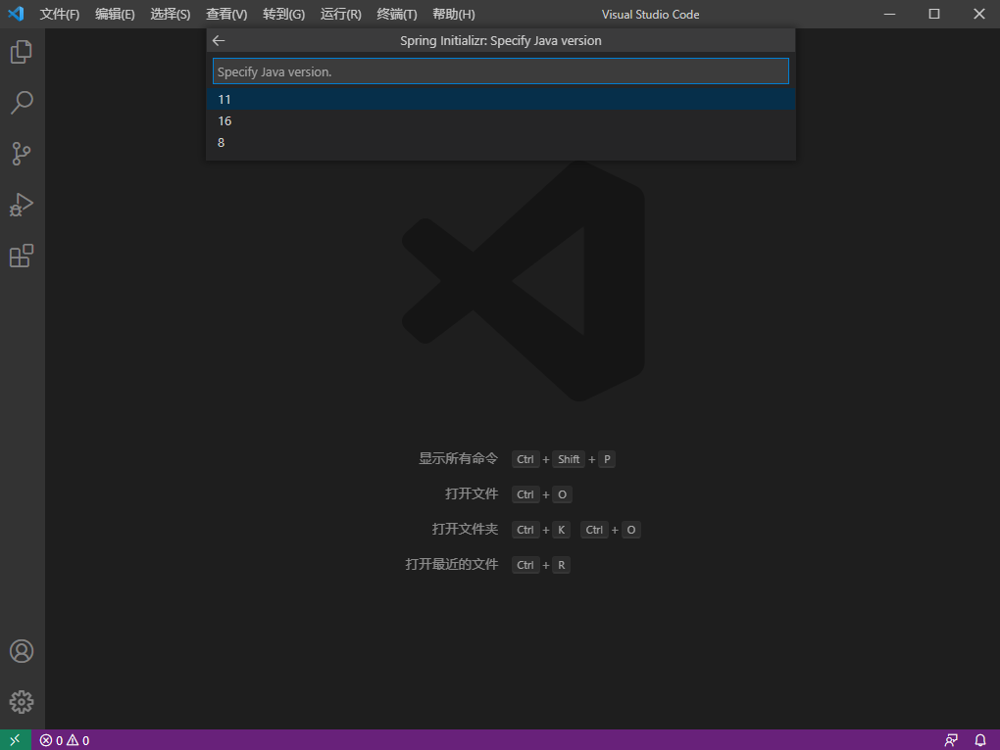

不用选择任何开发依赖模块（创建一个基础版的SpringBoot工程）
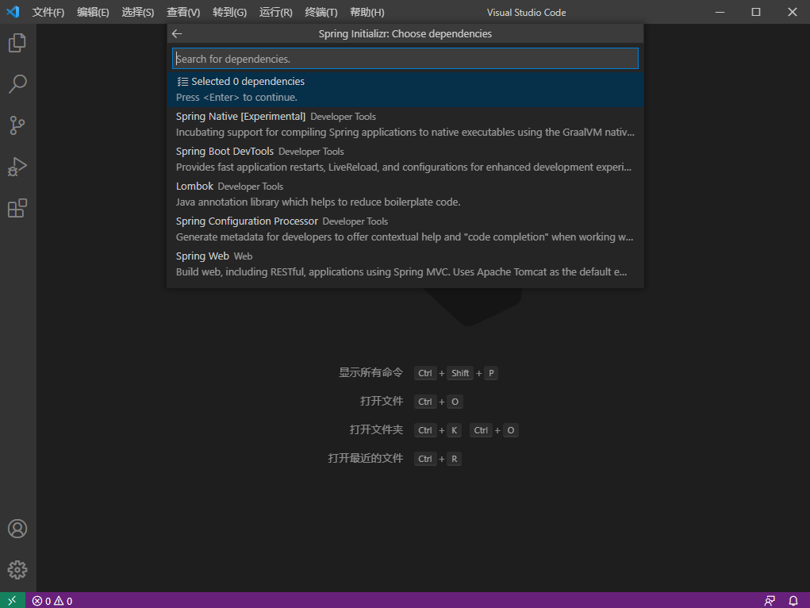

选择工程的保存位置
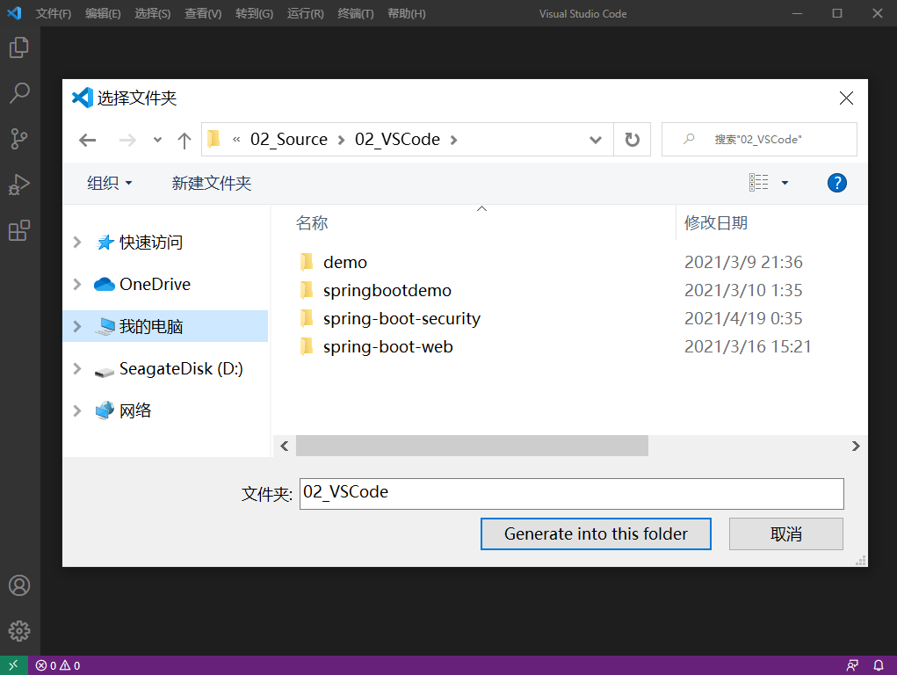

项目创建成功，使用SpringInitializr打开项目，点击Open按钮
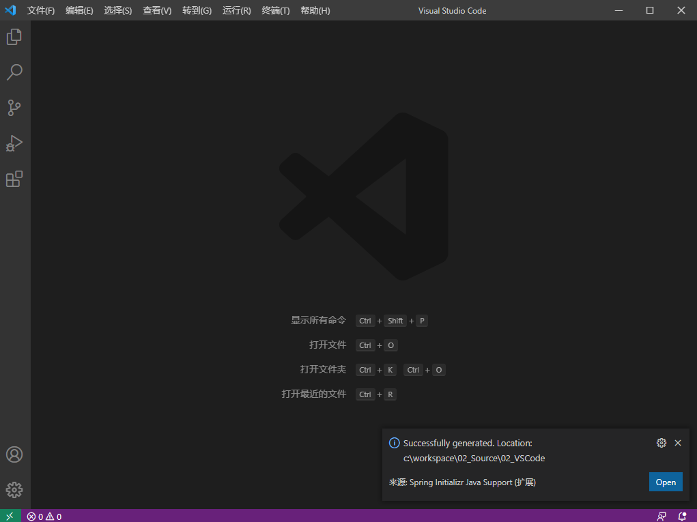

选择Yes
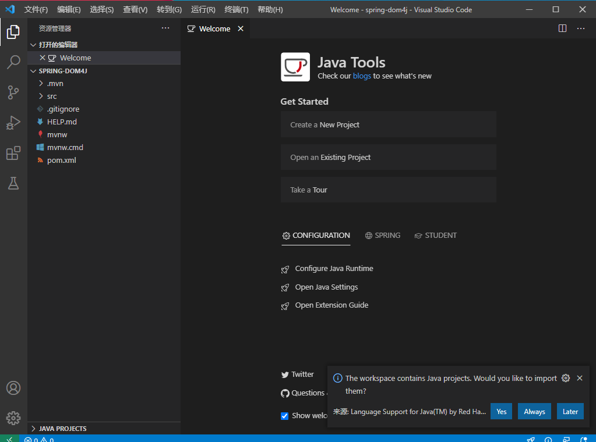

生成一个标准的Spring工程项目
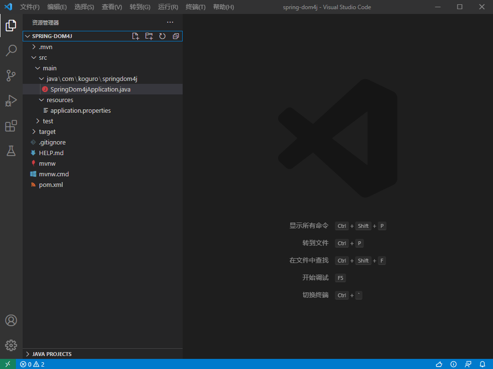

## 第二步：添加依赖模块
打开pom.xml文件，加入下面的模块
```xml
<dependency>
    <groupId>dom4j</groupId>
    <artifactId>dom4j</artifactId>
    <version>1.6.1</version>
</dependency>

<dependency>
	<groupId>jaxen</groupId>
	<artifactId>jaxen</artifactId>
	<version>1.1.1</version>
</dependency>
```
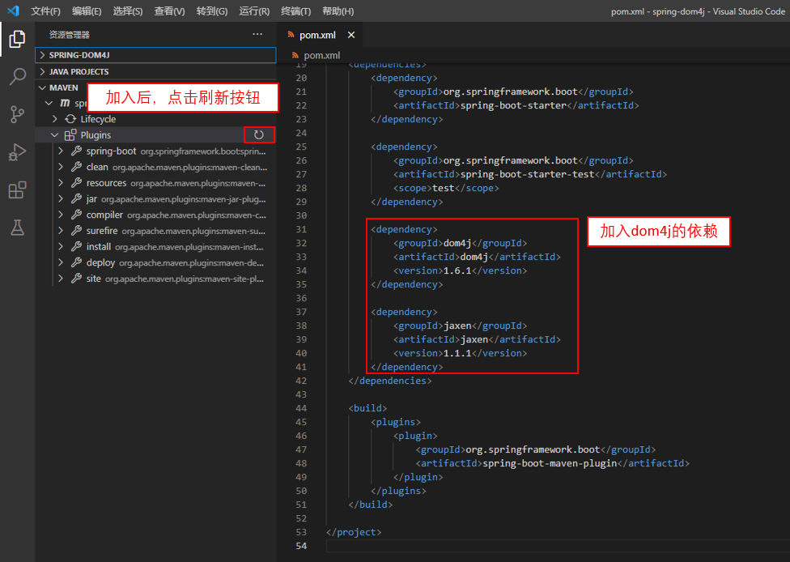

## 第三步：创建一个测试用的xml文件
在resouces下面添加一个config.xml文件
```xml
<?xml version="1.0" encoding="UTF-8" ?>
<class>
   <student rollno="393">
      <firstname>dinkar</firstname>
      <lastname>kad</lastname>
      <nickname>dinkar</nickname>
      <marks>85</marks>
   </student>

   <student rollno="493">
      <firstname>Vaneet</firstname>
      <lastname>Gupta</lastname>
      <nickname>vinni</nickname>
      <marks>95</marks>
   </student>

   <student rollno="593">
      <firstname>jasvir</firstname>
      <lastname>singn</lastname>
      <nickname>jazz</nickname>
      <marks>90</marks>
   </student>
</class>
```
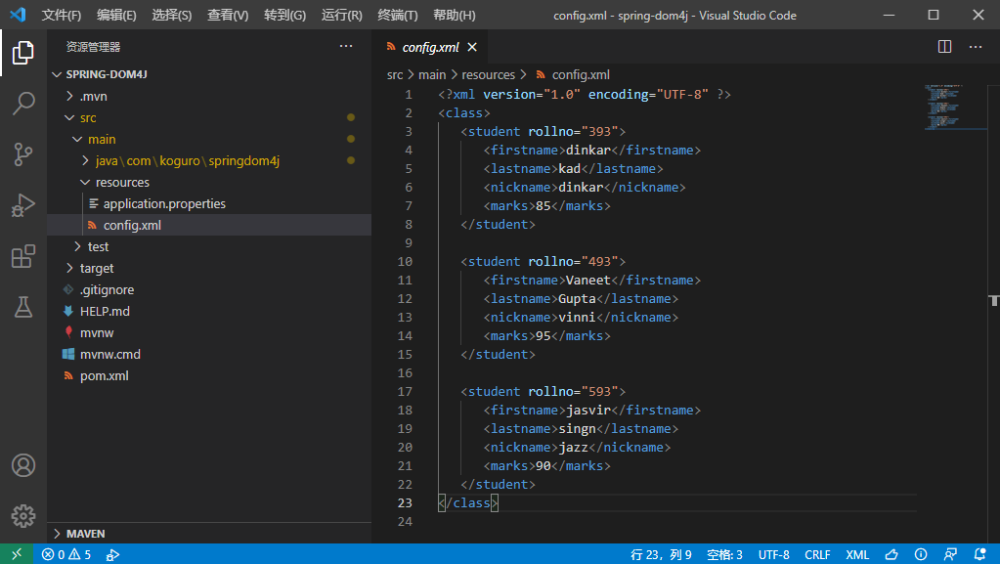

## 第四步：编写Java程序代码，解析xml文件
利用两种方式解析xml文件
第一种：获取指定节点的子节点的数据
第二种：一次读取指定节点的数据，得到子节点数据list。循环子节点的list对象，获取全部的子节点值。

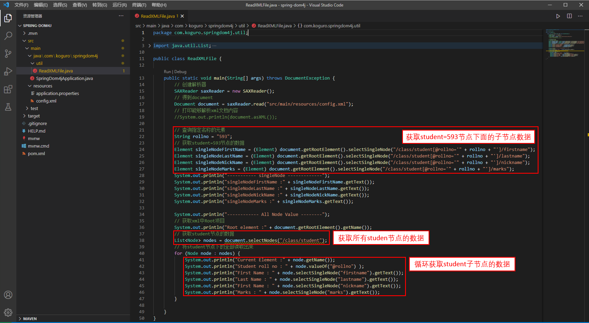

Java代码：
```java
package com.koguro.springdom4j.util;

import java.util.List;

import org.dom4j.Document;
import org.dom4j.DocumentException;
import org.dom4j.Element;
import org.dom4j.Node;
import org.dom4j.io.SAXReader;

public class ReadXMLFile {
    
    public static void main(String[] args) throws DocumentException {
        // 创建解析器
        SAXReader saxReader = new SAXReader();
        // 得到document
        Document document = saxReader.read("src/main/resources/config.xml");
        // 打印能够解析xml文档内容
        //System.out.println(document.asXML());
        
        // 查询指定名称的元素
        String rollno = "593";
        // 获取student=593节点的数据
        Element singleNodeFirstName = (Element) document.getRootElement().selectSingleNode("/class/student[@rollno='" + rollno + "']/firstname");
        Element singleNodeLastName = (Element) document.getRootElement().selectSingleNode("/class/student[@rollno='" + rollno + "']/lastname");
        Element singleNodeNickName = (Element) document.getRootElement().selectSingleNode("/class/student[@rollno='" + rollno + "']/nickname");
        Element singleNodeMarks = (Element) document.getRootElement().selectSingleNode("/class/student[@rollno='" + rollno + "']/marks");
        System.out.println("----------- singleNode -------------");
        System.out.println("singleNodeFirstName :" + singleNodeFirstName.getText());
        System.out.println("singleNodeLastName :" + singleNodeLastName.getText());
        System.out.println("singleNodeNickName :" + singleNodeNickName.getText());
        System.out.println("singleNodeMarks :" + singleNodeMarks.getText());

        System.out.println("------------ All Node Value --------");
        // 获取xml中Root项目
        System.out.println("Root element :" + document.getRootElement().getName());
        // 获取student节点的数据
        List<Node> nodes = document.selectNodes("/class/student");
        // 将student节点下的全部读取出来
        for (Node node : nodes) {
            System.out.println("Current Element :" + node.getName());
            System.out.println("Student roll no : " + node.valueOf("@rollno") );
            System.out.println("First Name : " + node.selectSingleNode("firstname").getText());
            System.out.println("Last Name : " + node.selectSingleNode("lastname").getText());
            System.out.println("First Name : " + node.selectSingleNode("nickname").getText());
            System.out.println("Marks : " + node.selectSingleNode("marks").getText());
        }

    }
}
```