# SpringBoot + Dom4j 解析XML文件

## 第一步：创建Spring工程
使用快捷键(Ctrl+Shift+P)命令窗口，输入 【Spring Initializr】选择创建 Maven 项目
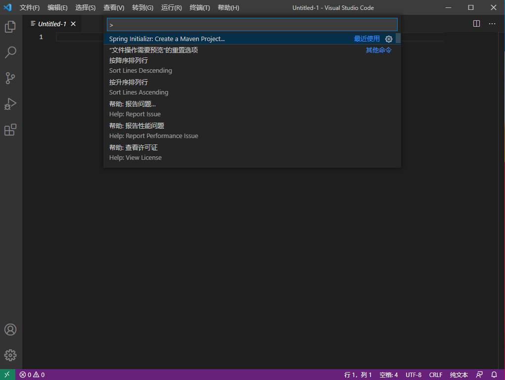

选择SpringBoot的版本
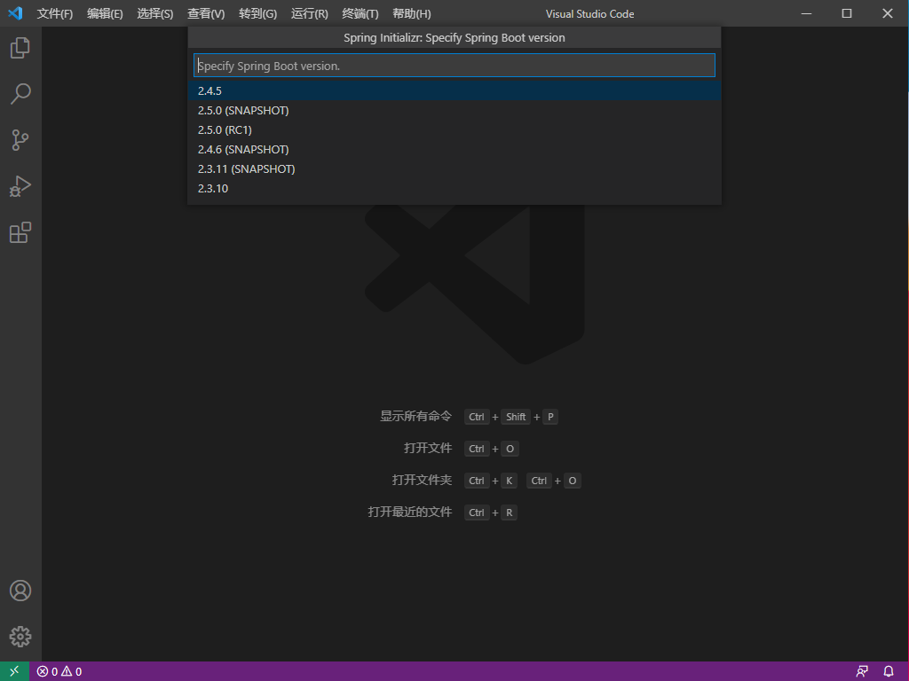

选在Java开发语言
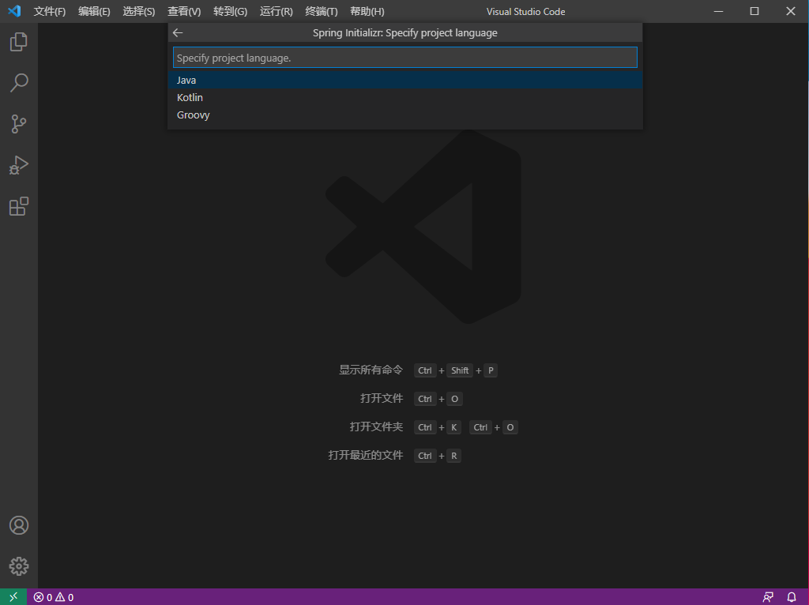

创建一个GroupId
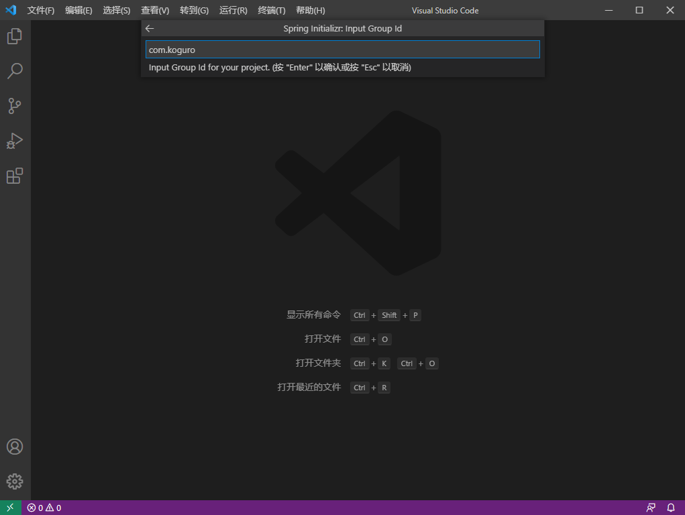

设置ArtifactId（项目工程名）
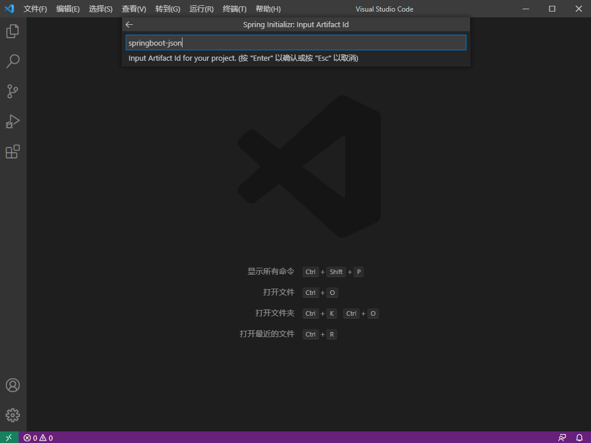

设置打包类型（生成jar包）
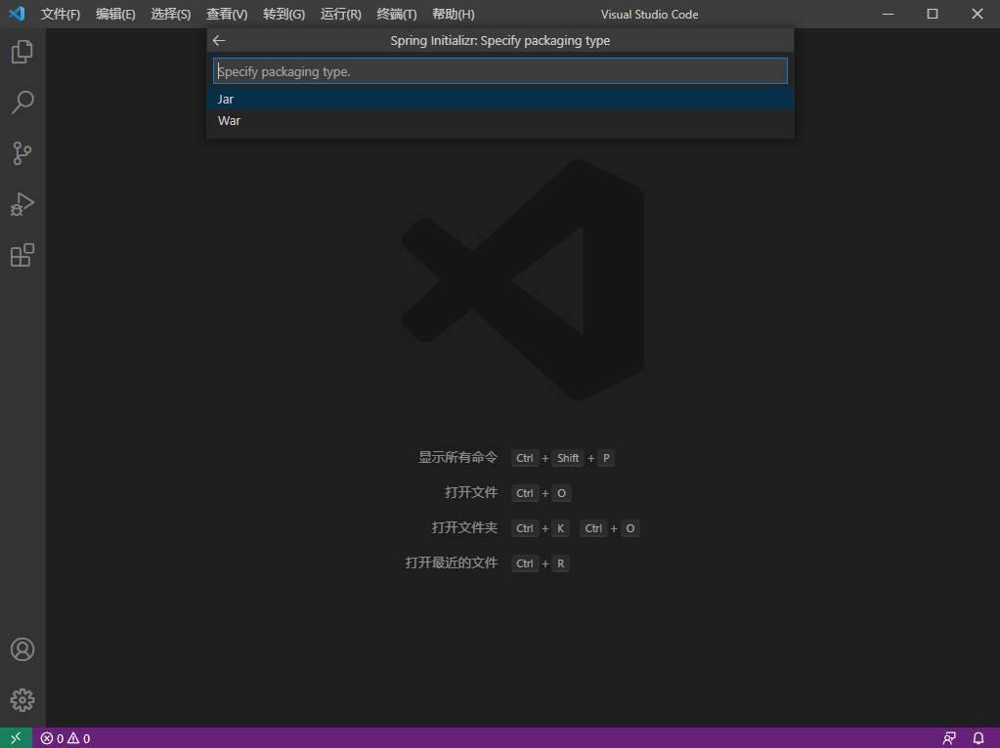

选在Java的版本号(使用Java 8)
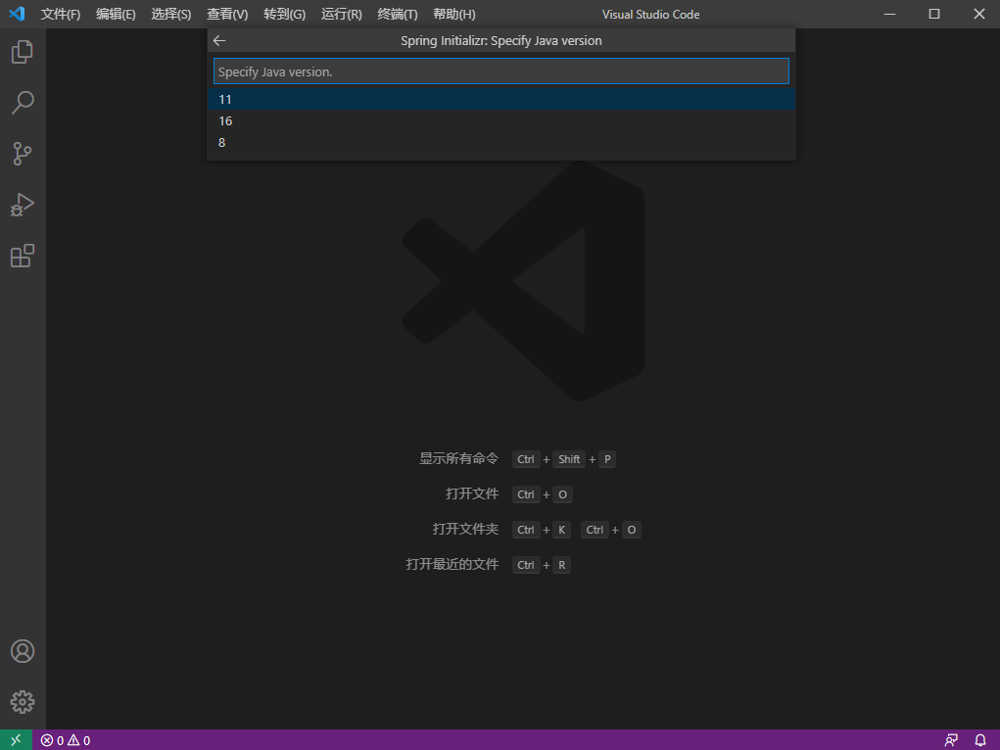

不用选择任何开发依赖模块（创建一个基础版的SpringBoot工程）
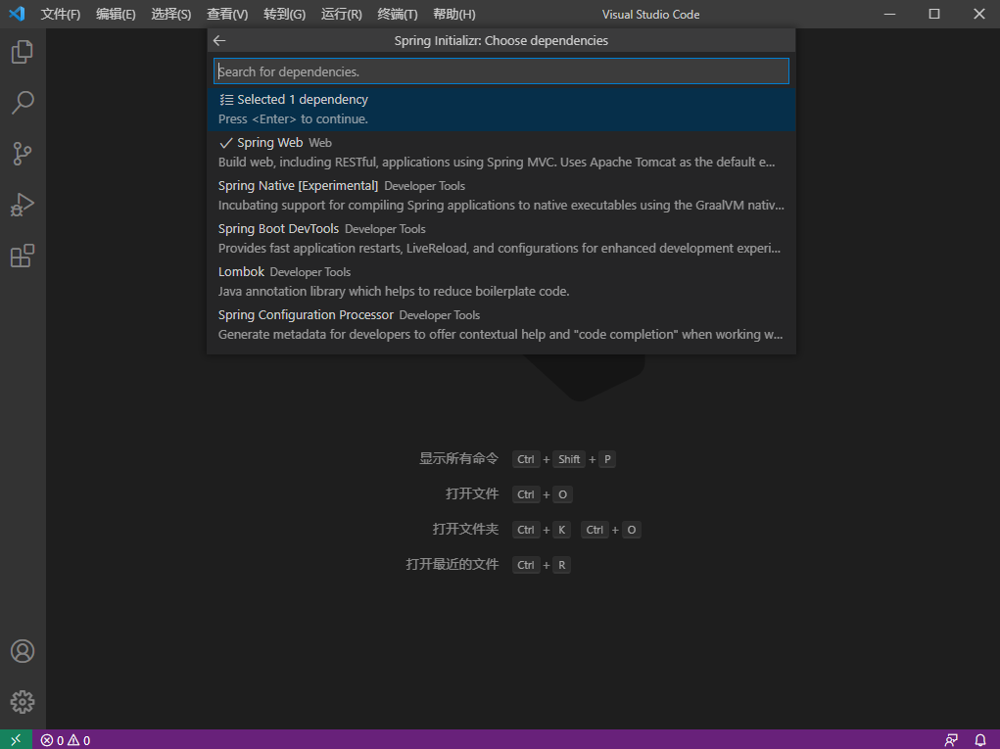

选择工程的保存位置
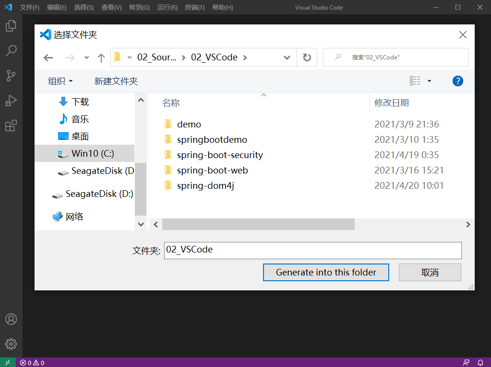

项目创建成功，使用SpringInitializr打开项目，点击Open按钮
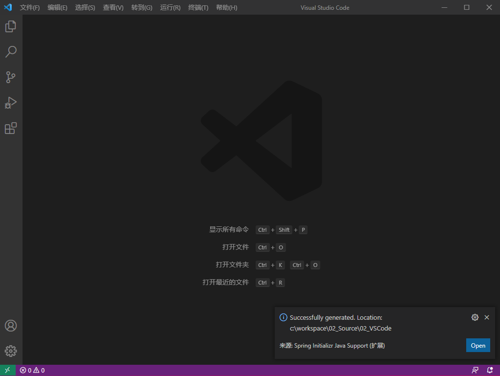

生成一个标准的Spring工程项目
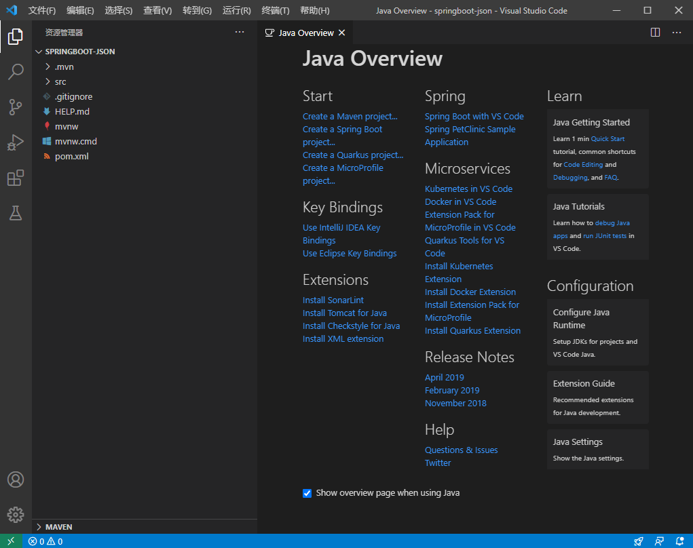

## 第二步：编写输出JSON数据测试类
SpringBoot自身框架，可以解析JSON数据，不需要引用其他模块。
1、创建entities类Employee
```java
package com.koguro.springbootjson.entities;

import java.util.Date;

public class Employee {

    private Integer id;
    private String lastName;
    private String email;
    private Integer gender;
    private Date birth;

    public Integer getId() {
        return id;
    }

    public void setId(Integer id) {
        this.id = id;
    }

    public String getLastName() {
        return lastName;
    }

    public void setLastName(String lastName) {
        this.lastName = lastName;
    }

    public String getEmail() {
        return email;
    }

    public void setEmail(String email) {
        this.email = email;
    }

    public Integer getGender() {
        return gender;
    }

    public void setGender(Integer gender) {
        this.gender = gender;
    }

    public Date getBirth() {
        return birth;
    }

    public void setBirth(Date birth) {
        this.birth = birth;
    }

    public Employee(Integer id, String lastName, String email, Integer gender) {
        super();
        this.id = id;
        this.lastName = lastName;
        this.email = email;
        this.gender = gender;
        this.birth = new Date();
    }

    public Employee() {
    }

    @Override
    public String toString() {
        return "Employee{" +
                "id=" + id +
                ", lastName='" + lastName + '\'' +
                ", email='" + email + '\'' +
                ", gender=" + gender +
                ", birth=" + birth +
                '}';
    }
}
```
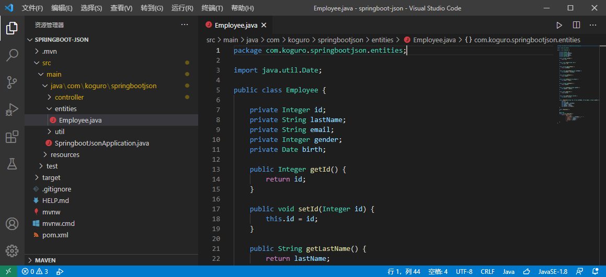

2、编写一个工具类，定义统一的 JSON 结构
```java
package com.koguro.springbootjson.util;

public class JsonResult<T> {

    private T data;
    private Integer code;
    private String msg;

    public static final int SUCCESS_RESULT = 0;
	public static final int ERROR_RESULT = 1;

    /**
     * 若没有数据返回，默认状态码为 0，提示信息为“操作成功！”
     */
    public JsonResult() {
        this.code = 0;
        this.msg = "操作成功！";
    }

    /**
     * 若没有数据返回，可以人为指定状态码和提示信息
     * @param code
     * @param msg
     */
    public JsonResult(Integer code, String msg) {
        this.code = code;
        this.msg = msg;
    }

    /**
     * 有数据返回时，状态码为 0，默认提示信息为“操作成功！”
     * @param data
     */
    public JsonResult(T data) {
        this.code = 0;
        this.msg = "操作成功！";
        this.data = data;
    }

    /**
     * 有数据返回，状态码为 0，人为指定提示信息
     * @param data
     * @param msg
     */
    public JsonResult(T data, String msg) {
        this.code = 0;
        this.msg = msg;
        this.data = data;
    }

    /**
     * 有数据返回，状态码为 1，异常信息
     * @param Throwable
     */
    public JsonResult(Throwable e) {
		this.code = ERROR_RESULT;
		this.msg = e.getMessage();
	}
	
    /**
     * 有数据返回，状态码为，异常信息
     * @param code
     * @param msg
     */
	public JsonResult(int code, Throwable e) {
		this.code = code;
		this.msg = e.getMessage();
	}

    public T getData() {
        return data;
    }

    public void setData(T data) {
        this.data = data;
    }

    public Integer getCode() {
        return code;
    }

    public void setCode(Integer code) {
        this.code = code;
    }

    public String getMsg() {
        return msg;
    }

    public void setMsg(String msg) {
        this.msg = msg;
    }   
}
```
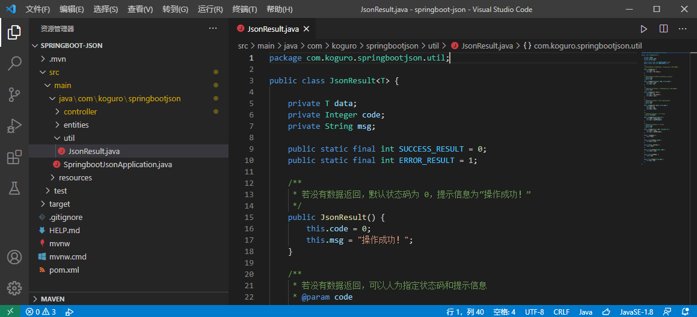

3、编写一个Controller类，用于处理数据
在Controller类中，使用注解@RestController，转换成JSON返回到页面上。
```java
package com.koguro.springbootjson.controller;

import com.koguro.springbootjson.entities.Employee;
import com.koguro.springbootjson.util.JsonResult;
import org.springframework.web.bind.annotation.*;

import java.util.ArrayList;
import java.util.List;

@RestController
public class EmployeeController {

    /**
     * 获取全部员工List
     * 给方法添加M参数都可以放在请求域中，专递给页面
     */
    @ResponseBody
    @RequestMapping(value = "emps")
    public JsonResult<List> empList() {

        List<Employee> empList = new ArrayList<>();
        empList.add(new Employee(1001, "E-AA", "aa@163.com", 1));
        empList.add(new Employee(1002, "E-BB", "bb@163.com", 1));
        empList.add(new Employee(1003, "E-CC", "cc@163.com", 0));
        empList.add(new Employee(1004, "E-DD", "dd@163.com", 0));
        
        return new JsonResult<>(empList, "获取用户列表成功");
    }

}
```
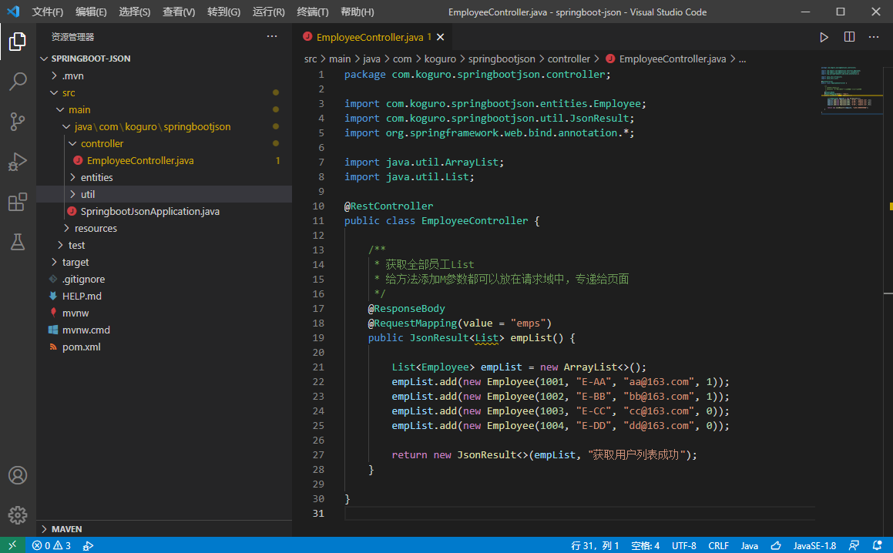

## 第三步：测试
1、打开SpringBoot的主程序类，点击左侧执行按钮
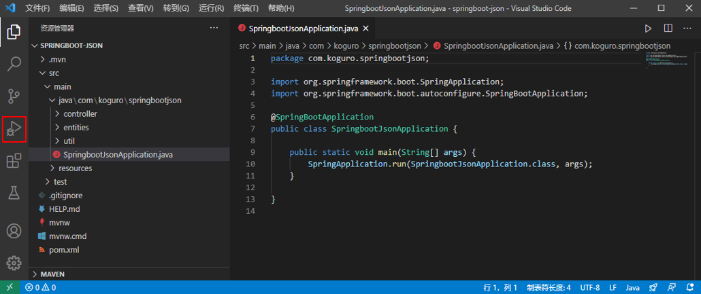

2、在页面中，执行【运行和测试】
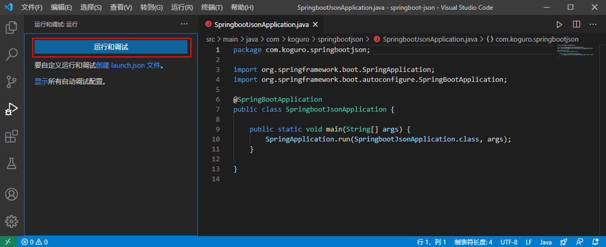

启动结果
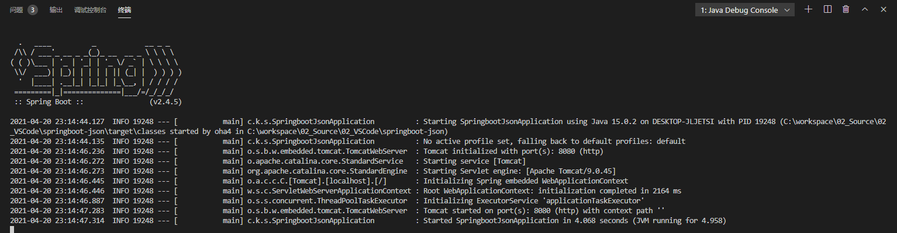

3、在浏览器中访问Controller
```
http://localhost:8080/emps
```
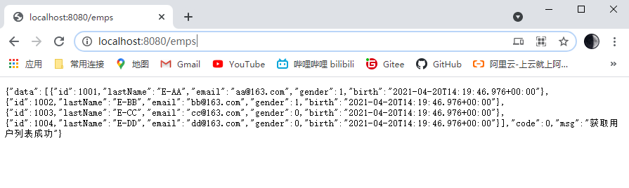

# End