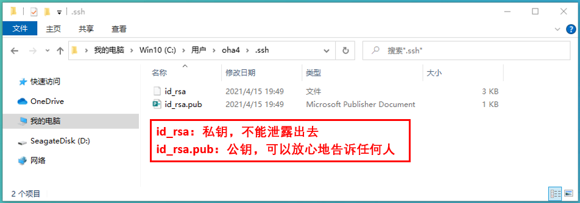

# GitHub 使用

## 简介

GitHub是一个面向开源及私有软件项目的托管平台，因为只支持Git作为唯一的版本库格式进行托管。作为一个<font color="red">分布的版本控制系统</font>，在Git中并不存在主库的概念，每一份复制出的库都可以独立使用，任何两个库之间的不一致之处都可以进行合并。

## GitHub的工作原理
仓库：本地仓库和远程仓库(托管在网络端的仓库)
本地仓库：工作区丶版本区，其中版本区包含暂存区丶仓库区
从本地仓库将文件git到远程仓库流程：工作区----> 暂存区 ----> 仓库区 ----> 远程仓库


## GitHub的常用命令


## Windows10 环境下使用GitHub
GitHub使用git分布式版本控制系统，而git最初是LinusTorvalds为帮助Linux开发而创造的，它针对的是Linux平台，因此git和Windows从来不是最好的朋友，因为它一点也不像Windows。GitHub发布了GitHub for Windows，为Windows平台开发者提供了一个易于使用的Git图形客户端。
GitHub for Windows是一个Metro风格应用程序，集成了自包含版本的Git，bash命令行shell，PowerShell的posh-git扩展。GitHub为Windows用户提供了一个基本的图形前端去处理大部分常用版本控制任务，可以创建版本库，向本地版本库递交补丁，在本地和远程版本库之间同步。微软也通过CodePlex向开发者提供git版本控制系统，而GitHub创造了一个更具有吸引力的Windows版本。

### 下载gitbash
github是远程的一个仓库，gitbash是win下一个工具，我们打代码都是在本地打代码，然后通过gitbash把自己代码传到github上面去。 
就好比，我们用迅雷从网上下载东西，gitbash就和迅雷很像啊，都是本地的一个软件，负责上传下载之类的。学github，其实学的就是如果用gitbash，就像你要下载东西，你肯定是学会如何使用迅雷。
```
下载地址：https://git-scm.com/downloads
```


### 安装gitbash
执行Git-2.31.1-64-bit.exe安装文件，默认安装即可

### 配置本地Git环境
1、启动本地Git Bash


2、设置系统的git签名信息
将自己注册的用户名和邮箱设置到Git的全局变量中
区分不同开发人员的身份，设置的前面信息，跟登录远程仓库的账户和密码没有关系
```
配置用户名：git config --global user.name koguro689
配置用户邮箱：git config --global user.email "ninglidl@163.com"
保存位置：windows系统的C:\Users\oha4\.gitconfig
```


3、设置postbuffer为500M(避免提交文件过多，发生错误)
```
git config --global http.postBuffer 524288000
```


如果在系统配置参数中解决不了上传失败的问题，就设置项目的postbuffer
```
git config http.postBuffer 524288000
保存位置：自己创建的文件夹下.git/config
```

4、查看配置信息
```
git config --list
```


5、删除指定错误的全局变量
```
git config --global --unset http.postBuffer
git config --global --unset http.version
```


### 创建SSH Key
1、执行命令，指定注册的邮箱，创建公开密钥和私有密钥
```
ssh-keygen -t rsa -C "ninglidl@163.com"
-C 冒号里面是自己注册的邮箱地址
```


2、查看生成的密钥
在当前用户的文件夹下面生成一个<font color="red">.ssh</font>的文件夹


进入文件夹内部，可以看到生成的密钥文件


使用cat命令开打id_rsa.pub文件


3、将公钥设置在GitHub上面
在Web页面登录自己的GitHub账户，点击自己的属性下面的【Settings】


点击侧边栏的【SSH and GPG keys】


在设置画面里面点击【New SSH key】


拷贝本地生成的公开加密键值


设置Title的值，再将公开加密键值粘贴到key栏里面


### 将本地代码上传到远程仓库中
1、创建一个本地代码管理目录


2、将docsify生成的docs文件夹整体放到这个目录下


3、在Git Bash里面进入01_docsify_blog目录下
```
cd /c/workspace/02_Source/01_GitHub/01_docsify_docs
```


4、初期化文件夹本地代码仓库
```
git init
```


5、查看git文件夹下的状态


6、执行add命令，将资源放进待提交区
```
git add .
1.【.】:把所有内容，全部添加
2.也可以指定名字，单独添加
```


7、为提交的代码添加备注
```
git commit -m "[Add] 2021-04-19 My First Commit Blog Sources"
```


8、查看git的log
```
git log
```


9、Push到远程的仓库中
```
git remote add origin https://github.com/koguro689/myblogs.git
git remote -v
```


10、查看当前的分支
```
git branch
```


11、将资源push到当前分支中
```
git push origin master
```


12、通过IE浏览器，查看远程仓库中的代码


13、由于在远程仓库中，手动添加CNAME文件，将远程仓库代码同步到本地
```
git pull origin master
```


### 修改本地代码后，上传到远程仓库中
1、修改本地代码


2、添加新的代码


3、查看本地仓库的Git状态
```
git status
```


4、执行add命令，将资源放进待提交区
```
git add .
```


5、为提交的代码添加备注
```
git commit -m "[Update] 2021-04-19 Commit My Blog Sources"
```


6、Pull同步到远程的仓库中
```
git pull origin master
```


7、上推本地修改
```
git push origin master
```


8、查看Git远程仓库的代码


## MacOS 环境下使用GitHub

# End