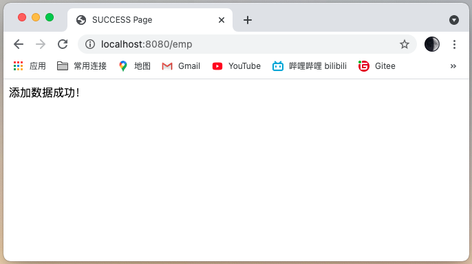
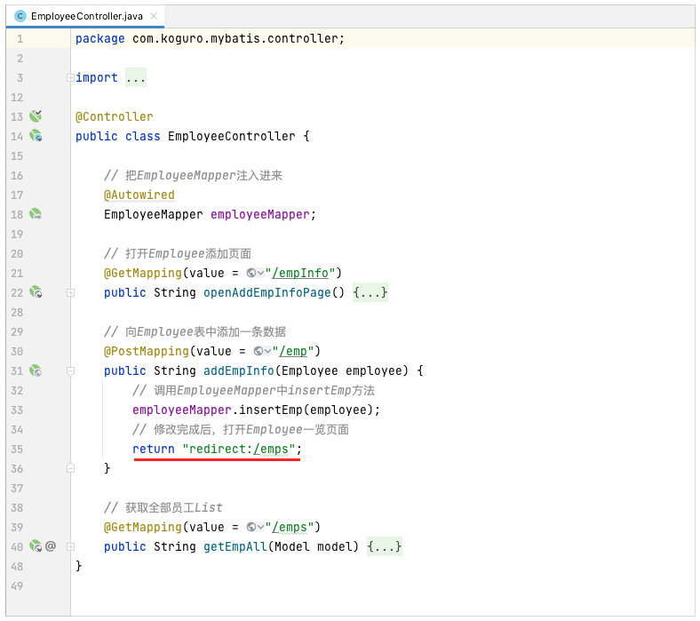

# MyBaits 基本使用

# 使用MyBaits配置文件实现「增、删、改、查」功能

## 前期准备
1、创建测试表
```sql
-- 创建数据库
CREATE DATABASE koguro;
-- 使用数据库
USE koguro;
-- 创建测试表
DROP TABLE IF EXISTS `tbl_employee`;
CREATE TABLE `tbl_employee` (
    `id` int NOT NULL AUTO_INCREMENT,
    `lastName` varchar(255) NOT NULL,
    `email` varchar(255) NOT NULL,
    `gender` int NOT NULL,
	`age` int NOT NULL,
    PRIMARY KEY (`id`)
) ENGINE=InnoDB AUTO_INCREMENT=2001 DEFAULT CHARSET=utf8;
-- 创建测试数据
INSERT INTO tbl_employee(lastName, email, gender, age) VALUES ('Tom','tom@163.com',1,22);
INSERT INTO tbl_employee(lastName, email, gender, age) VALUES ('Jerry','jerry@163.com',2,20);
INSERT INTO tbl_employee(lastName, email, gender, age) VALUES ('Black','black@163.com',1,21);
INSERT INTO tbl_employee(lastName, email, gender, age) VALUES ('White','white@163.com',2,25);
```


2、创建一个SpringBoot的Maven工程
使用Spring的开发组件「Spring Initializr」创建SpringBoot工程


3、添加需要的依赖


4、在pom文件中引入其他的依赖

```xml
<!-- alibaba数据源druid 依赖 -->
<dependency>
    <groupId>com.alibaba</groupId>
    <artifactId>druid</artifactId>
    <version>1.1.22</version>
</dependency>
<!-- 引入jquery-webjar -->
<dependency>
    <groupId>org.webjars</groupId>
    <artifactId>jquery</artifactId>
    <version>3.6.0</version>
</dependency>
```

5、在SpringBoot的yml配置文件中，配置连接MySQL数据库

```yml
# 加载连接MySQL数据库
spring:
  datasource:
    driver-class-name: com.mysql.cj.jdbc.Driver
    url: jdbc:mysql://localhost:3306/koguro?characterEncoding=utf-8&serverTimezone=UTC
    username: root
    password: zaq12wsx
```

## 编写SQL相关功能
1、创建Employee的Entity

```java
package com.koguro.mybatis.entity;

public class Employee {

    private Integer id;
    private String lastName;
    private String email;
    private Integer gender;
    private Integer age;

    public Employee() {
    }

    public Employee(Integer id, String lastName,
                    String email, Integer gender, Integer age) {
        this.id = id;
        this.lastName = lastName;
        this.email = email;
        this.gender = gender;
        this.age = age;
    }

    public Integer getId() {
        return id;
    }

    public void setId(Integer id) {
        this.id = id;
    }

    public String getLastName() {
        return lastName;
    }

    public void setLastName(String lastName) {
        this.lastName = lastName;
    }

    public String getEmail() {
        return email;
    }

    public void setEmail(String email) {
        this.email = email;
    }

    public Integer getGender() {
        return gender;
    }

    public void setGender(Integer gender) {
        this.gender = gender;
    }

    public Integer getAge() {
        return age;
    }

    public void setAge(Integer age) {
        this.age = age;
    }

    @Override
    public String toString() {
        return "Employee{" +
                "id=" + id +
                ", lastName='" + lastName + '\'' +
                ", email='" + email + '\'' +
                ", gender=" + gender + '\'' +
                ", age='" + age +
                '}';
    }
}
```

2、创建EmployeeMapper接口类，对数据库表，进行「增、删、改、查」操作。

```java
package com.koguro.mybatis.mapper;

import com.koguro.mybatis.entity.Employee;
import org.apache.ibatis.annotations.Mapper;

import java.util.List;

// @Mapper将接口扫描装配到Spring容器中
@Mapper
public interface EmployeeMapper {

    // 增：添加数据到Employee表里面
    int insertEmp(Employee employee);

    // 删：根据id，删除Employee表的数据
    int deleteById(Integer id);

    // 改：根据id，更新Employee表的字段
    int updateEmp(Employee employee);

    // 查：获取Employee表的全部数据
    List<Employee> getEmpList();

    // 查：获取Employee表的指定ID的数据
    Employee getEmpById(Integer id);

}
```

3、创建一个EmployeeMapper的映射文件「EmployeeMapper.xml」，实现SQL文。

```xml
<?xml version="1.0" encoding="UTF-8" ?>
<!DOCTYPE mapper PUBLIC "-//mybatis.org//DTD Mapper 3.0//EN"
        "http://mybatis.org/dtd/mybatis-3-mapper.dtd">

<!-- 关联EmployeeMapper类 -->
<mapper namespace="com.koguro.mybatis.mapper.EmployeeMapper">
    <!-- 关联添加Employee信息方法 -->
    <insert id="insertEmp">
        insert into tbl_employee(lastName, email, gender, age) values (#{lastName}, #{email}, #{gender}, #{age})
    </insert>

    <!-- 关联删除Employee信息方法 -->
    <delete id="deleteById">
        delete from tbl_employee where id=#{id}
    </delete>

    <!-- 关联更新Employee信息方法 -->
    <update id="updateEmp">
        update tbl_employee set lastName=#{lastName}, email=#{email}, gender=#{gender}, age=#{age} where id=#{id}
    </update>

    <!-- 关联查询Employee信息方法 -->
    <select id="getEmpList" resultType="com.koguro.mybatis.entity.Employee">
        select id, lastName, email, gender, age from tbl_employee
    </select>

    <!-- 关联查询指定ID的Employee信息方法 -->
    <select id="getEmpById" resultType="com.koguro.mybatis.entity.Employee">
        select * from tbl_employee where id = #{id}
    </select>

</mapper>
```

4、将EmployeeMapper的映射文件，添加到SpringBoot的yml配置文件中，启动服务时，加载映射文件

```yml
# 加载MyBatis映射文件
mybatis:
  mapper-locations: classpath:mybatis/mapper/*.xml
```

## 编写处理功能
1、创建Employee添加页面

```html
<!DOCTYPE html>
<html lang="en" xmlns:th="http://www.thymeleaf.org">
    <head>
        <meta charset="UTF-8">
        <title>Employee 添加数据 Page</title>
    </head>
    <body>
        <form th:action="@{/emp}" method="post">
            <div>
                <label th:text="姓名：" />
                <input type="text" name="lastName" th:placeholder="请输入姓名">
            </div>
            <div>
                <label th:text="电子邮箱：" />
                <input type="text" name="email" th:placeholder="请输入电子邮箱">
            </div>
            <div>
                <label th:text="性别：" />
                <input type="radio" name="gender" value="1"><label th:text="男" />
                <input type="radio" name="gender" value="2"><label th:text="女" />
            </div>
            <div>
                <label th:text="年龄：" />
                <input type="text" name="age" th:placeholder="请输入年龄">
            </div>
            <button type="submit" th:text="添加" />
        </form>
    </body>
</html>
```

2、创建Controller访问添加页面

```java
package com.koguro.mybatis.controller;

import org.springframework.stereotype.Controller;
import org.springframework.web.bind.annotation.GetMapping;

@Controller
public class EmployeeController {

    // 打开Employee添加页面
    @GetMapping(value = "/empInfo")
    public String openAddEmpInfoPage() {
        // 模版框架thymeleaf会根据
        // 前缀默认值 + 自己设置值拼接字符串 + 后缀默认值
        // classpath:/templates/ + employee + .html
        return "/employee";
    }
}
```

测试：Employee添加数据画面
```
http://localhost:8080/empInfo
```


3、在Contrller中添加代码（实现添加Employee数据功能）

```java
// 把EmployeeMapper注入进来
@Autowired
EmployeeMapper employeeMapper;

// 向Employee表中添加一条数据
@PostMapping(value = "/emp")
public String addEmpInfo(Employee employee) {
    // 调用EmployeeMapper中insertEmp方法
    employeeMapper.insertEmp(employee);
    // 跳转到成功页面
    return "/success";
}
```
成功页面success.html
```html
<!DOCTYPE html>
<html lang="en">
    <head>
        <meta charset="UTF-8">
        <title>SUCCESS Page</title>
    </head>
    <body>
      添加数据成功！
    </body>
</html>
```

测试：Employee添加数据功能
```
http://localhost:8080/empInfo
```


添加数据成功后，跳转到SUCCESS页面



4、在Contrller中添加代码（实现查询全部Employee数据功能）

```java
// 获取全部员工List
@GetMapping(value = "/emps")
public String getEmpAll(Model model) {
    // 从EmployeeMapper中获取所以员工的信息
    List<Employee> employees = employeeMapper.getEmpList();
    // 将得到employees放在请求域中
    model.addAttribute("emps", employees);
    // 跳转到Employee一览页面
    return "/employeeList";
}
```


```html
<!DOCTYPE html>
<html lang="en" xmlns:th="http://www.thymeleaf.org">
    <head>
        <meta charset="UTF-8">
        <title>Employee 一览 Page</title>
    </head>
    <body>
        <table>
            <thead>
                <tr>
                    <th>#</th>
                    <th>lastName</th>
                    <th>email</th>
                    <th>gender</th>
                    <th>age</th>
                </tr>
            </thead>
            <tbody>
                <tr th:each="emp:${emps}">
                    <td th:text="${emp.id}"></td>
                    <td th:text="${emp.lastName}"></td>
                    <td th:text="${emp.email}"></td>
                    <td th:text="${emp.gender}==0?'女':'男'"></td>
                    <td th:text="${emp.age}"></td>
                </tr>
            </tbody>
        </table>
    </body>
</html>
```

测试：Employee查询功能
访问查询处理
```
http://localhost:8080/emps
```


5、在Contrller中修改代码（实现成功添加数据后，跳转到一览画面）


测试：Employee成功添加数据后，跳转到一览画面
```
http://localhost:8080/empInfo
```


添加数据成功后，跳转到一览画面


6、在Contrller中添加代码（实现修改指定Employee数据功能）

6-1、添加根据ID查询Employee数据

```java
// 打开修改员工信息页面（共用添加画面）
@GetMapping(value = "/emp/{id}")
public String openEditPage(@PathVariable("id") Integer empId, Model model) {
    // 根据页面传递过来的empId信息，得到对应的员工信息
    Employee employee = employeeMapper.getEmpById(empId);
    System.out.println("正在编辑的员工信息：" + employee);
    // 等得到的员工信息在页面表示
    model.addAttribute("emp", employee);
    // 打开员工编辑画面
    return "/employee";
}
```
在一览画面中添加一个「编辑」的链接

```html
<!DOCTYPE html>
<html lang="en" xmlns:th="http://www.thymeleaf.org">
    <head>
        <meta charset="UTF-8">
        <title>Employee 一览 Page</title>
    </head>
    <body>
        <table>
            <thead>
                <tr>
                    <th>#</th>
                    <th>lastName</th>
                    <th>email</th>
                    <th>gender</th>
                    <th>age</th>
                    <th>操作</th>
                </tr>
            </thead>
            <tbody>
                <tr th:each="emp:${emps}">
                    <td th:text="${emp.id}"></td>
                    <td th:text="${emp.lastName}"></td>
                    <td th:text="${emp.email}"></td>
                    <td th:text="${emp.gender}==0?'女':'男'"></td>
                    <td th:text="${emp.age}"></td>
                    <td>
                        <a th:href="@{/emp/} + ${emp.id}">编辑</a>
                    </td>
                </tr>
            </tbody>
        </table>
    </body>
</html>
```
添加画面和修改画面，公用一个页面。修改Employee添加数据画面，显示根据ID查询出来的Employee数据

```html
<!DOCTYPE html>
<html lang="en" xmlns:th="http://www.thymeleaf.org">
    <head>
        <meta charset="UTF-8">
        <title>Employee 添加数据 Page</title>
    </head>
    <body>
        <form th:action="@{/empInfo}" method="post">
            <input type="hidden" name="id" th:if="${emp!=null}" th:value="${emp.id}">
            <div>
                <label th:text="姓名：" />
                <input type="text" name="lastName" th:placeholder="请输入姓名" th:value="${emp!=null}?${emp.lastName}">
            </div>
            <div>
                <label th:text="电子邮箱：" />
                <input type="text" name="email" th:placeholder="请输入电子邮箱" th:value="${emp!=null}?${emp.email}">
            </div>
            <div>
                <label th:text="性别：" />
                <input type="radio" name="gender" value="1" th:checked="${emp!=null}?${emp.gender==1}"><label th:text="男" />
                <input type="radio" name="gender" value="2" th:checked="${emp!=null}?${emp.gender==2}"><label th:text="女" />
            </div>
            <div>
                <label th:text="年龄：" />
                <input type="text" name="age" th:placeholder="请输入年龄" th:value="${emp!=null}?${emp.age}">
            </div>
            <button type="submit" th:text="${emp!=null}?'修改':'添加'"/>
        </form>
    </body>
</html>
```

测试：修改一个指定Employee信息
访问Employee一览画面
```
http://localhost:8080/emps
```


打开指定Employee的编辑画面，打开「2012」的编辑画面


6-2、添加更新Employee的功能

```java
// 根据员工ID，更新对应的信息
@PutMapping(value = "/emp")
public String updateEmployee(Employee employee) {
    // 在控制台中打印页面修改的Employee内容
    System.out.println("修改的员工数据：" + employee);
    // 更新Employee信息
    employeeMapper.updateEmp(employee);
    // 修改完成后，打开Employee一览页面
    return "redirect:/emps";
}
```
涉及Restful开发模式，参考其他资料，这里不详细说明。

在添加画面上添加put请求功能
修改完成后，点击「修改」按钮，要发出一个PUT请求修改员工数据。
但是，页面只支持POST、GET请求处理，需要自己指定一个PUT请求处理。

```html
<!DOCTYPE html>
<html lang="en" xmlns:th="http://www.thymeleaf.org">
    <head>
        <meta charset="UTF-8">
        <title>Employee 添加数据 Page</title>
    </head>
    <body>
        <form th:action="@{/empInfo}" method="post">
            <!--
                1、SpringMVC中配置HiddenHttpMethodFilter;（SpringBoot自动配置好的）
                2、页面创建一个post表单
                3、创建一个input项，name="_method"，值就是我们指定的请求方式
            -->
            <input type="hidden" name="_method" value="put" th:if="${emp!=null}" />
            <input type="hidden" name="id" th:if="${emp!=null}" th:value="${emp.id}">
            <div>
                <label th:text="姓名：" />
                <input type="text" name="lastName" th:placeholder="请输入姓名" th:value="${emp!=null}?${emp.lastName}">
            </div>
            <div>
                <label th:text="电子邮箱：" />
                <input type="text" name="email" th:placeholder="请输入电子邮箱" th:value="${emp!=null}?${emp.email}">
            </div>
            <div>
                <label th:text="性别：" />
                <input type="radio" name="gender" value="1" th:checked="${emp!=null}?${emp.gender==1}"><label th:text="男" />
                <input type="radio" name="gender" value="2" th:checked="${emp!=null}?${emp.gender==2}"><label th:text="女" />
            </div>
            <div>
                <label th:text="年龄：" />
                <input type="text" name="age" th:placeholder="请输入年龄" th:value="${emp!=null}?${emp.age}">
            </div>
            <button type="submit" th:text="${emp!=null}?'修改':'添加'"/>
        </form>
    </body>
</html>
```
在SpringBoot的配置文件中开启此功能

```yml
spring:
  # 开启mvc的HiddenHttpMethodFilter，使表单可以发送PUT、DELETE等请求
  mvc:
    hiddenmethod:
      filter:
        enabled: true
```

测试：修改一个指定Employee信息
打开指定Employee的编辑画面，打开「2012」的编辑画面
修改页面的数据


修改成功后，跳转到一览画面


7、在Contrller中添加代码（实现删除指定Employee数据功能）

```java
// 根据员工ID，删除对应的信息
@DeleteMapping(value = "/emp/{id}")
public String deleteEmployee(@PathVariable("id") Integer empId) {
    // 从Employee中，删除对应的信息
    employeeMapper.deleteById(empId);
    // 删除完成后，打开Employee一览页面
    return "redirect:/emps";
}
```
在Employee一览画面上添加delete请求功能
点击「删除」按钮，要发出一个DELETE请求修改员工数据。
但是，页面只支持POST、GET请求处理，需要自己指定一个DELETE请求处理。

```html
<!-- 添加的代码 -->
<script type="text/javascript" th:src="@{/webjars/jquery/3.6.0/jquery.js}"></script>

<button class="deleteBtn" th:attr="del_uri=@{/emp/} + ${emp.id}">删除</button>

<!-- 定义删除请求用的form表单 用于提交DELETE请求 -->
<form id="deleteEmpForm"  method="post">
    <input type="hidden" name="_method" value="delete" />
</form>

<script>
    // 用jquery处理删除提交请求
    // 当点击「删除按钮」是，执行处理
    $(".deleteBtn").click(function(){
        // 删除当前员工的
        // 修改表单的地址，把表单的action改成{/emp/emp.id}
        $("#deleteEmpForm").attr("action", $(this).attr("del_uri")).submit();
        return false;
    });
</script>
```

测试删除功能
访问Employee一览画面
```
http://localhost:8080/emps
```


执行指定ID（「2012」）的删除按钮


删除后的一览画面

