# MyBatisPlus 多表查询

## 前期准备
创建两个表，一个「tbl_user」用户表和「tbl_account」账户表
1、创建测试表
```sql
-- 创建数据库
CREATE DATABASE koguro;
-- 使用数据库
USE koguro;

-- 创建测试表
DROP TABLE IF EXISTS `tbl_user`;
CREATE TABLE `tbl_user` (
    `id` int NOT NULL AUTO_INCREMENT,
    `wid` int NOT NULL,
    `userName` varchar(255) NOT NULL,
    `email` varchar(255) NOT NULL,
    `gender` int NOT NULL,
	`age` int NOT NULL,
    PRIMARY KEY (`id`)
) ENGINE=InnoDB AUTO_INCREMENT=1 DEFAULT CHARSET=utf8;
-- 创建测试数据
INSERT INTO tbl_user(wid, userName, email, gender, age) VALUES (1, 'Tom', 'tom@163.com', 1, 22);
INSERT INTO tbl_user(wid, userName, email, gender, age) VALUES (1, 'Jerry', 'jerry@163.com', 2, 20);
INSERT INTO tbl_user(wid, userName, email, gender, age) VALUES (2, 'Black', 'black@163.com', 1, 21);
INSERT INTO tbl_user(wid, userName, email, gender, age) VALUES (2, 'White', 'white@163.com', 2, 25);

-- 创建测试表
DROP TABLE IF EXISTS `tbl_work`;
CREATE TABLE `tbl_work` (
    `id` int NOT NULL AUTO_INCREMENT,
    `position` varchar(50) NOT NULL,
    PRIMARY KEY (`id`)
) ENGINE=InnoDB AUTO_INCREMENT=1 DEFAULT CHARSET=utf8;
-- 创建测试数据
INSERT INTO tbl_work(position) VALUES ('Work001');
INSERT INTO tbl_work(position) VALUES ('Work002');
```
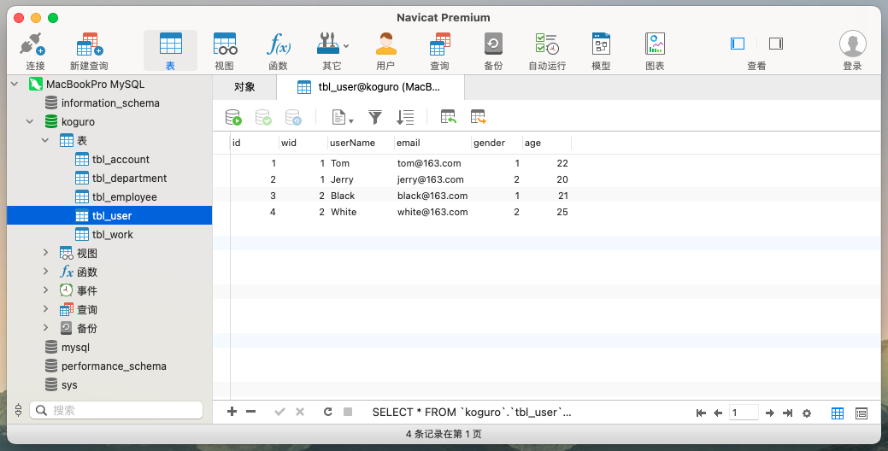
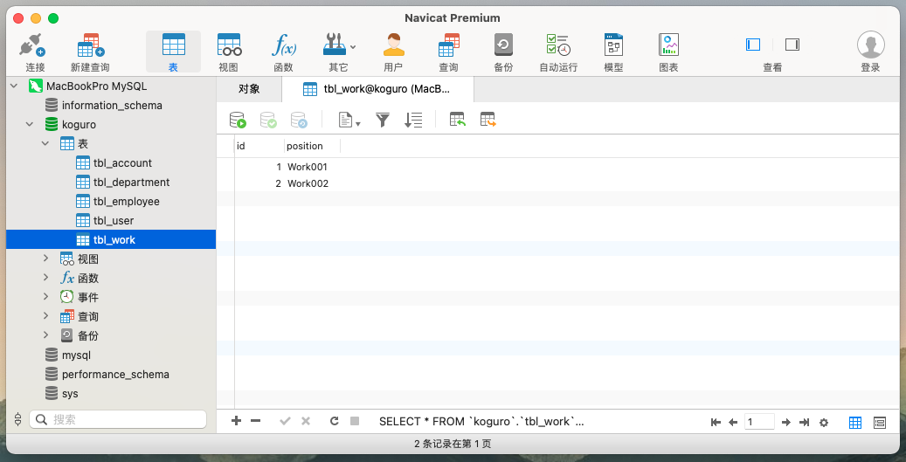

2、创建一个SpringBoot的Maven工程
使用Spring的开发组件「Spring Initializr」创建SpringBoot工程
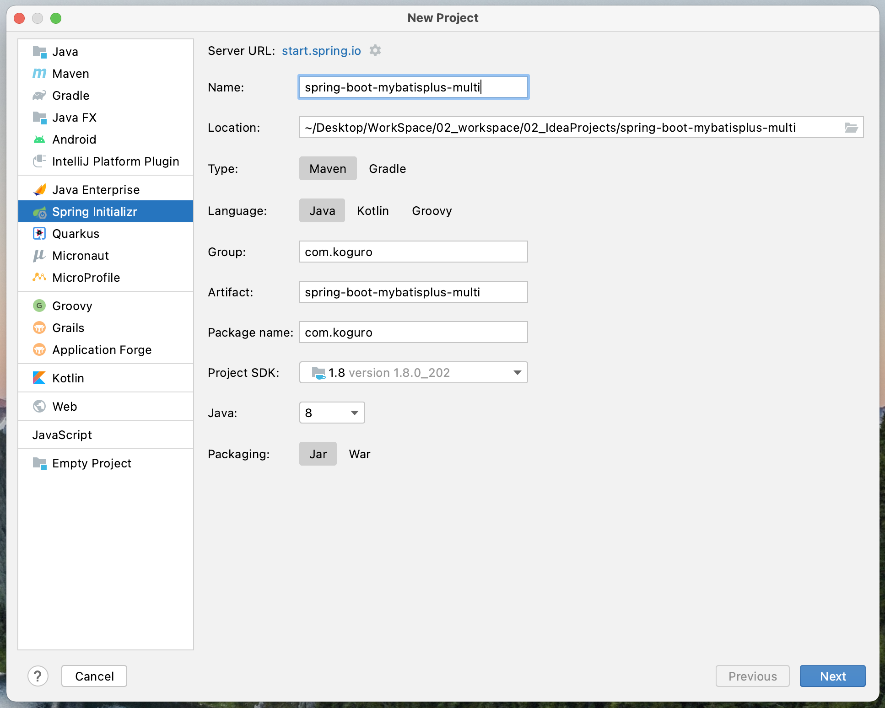

3、添加需要的依赖
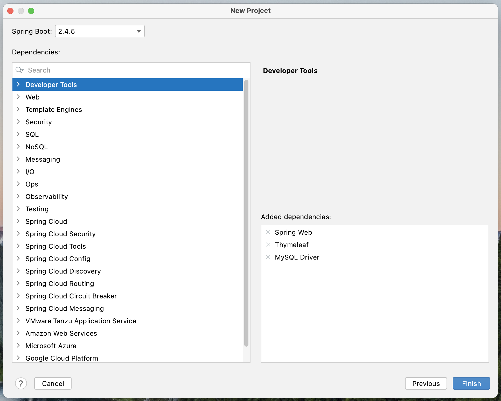

4、在pom文件中引入其他的依赖
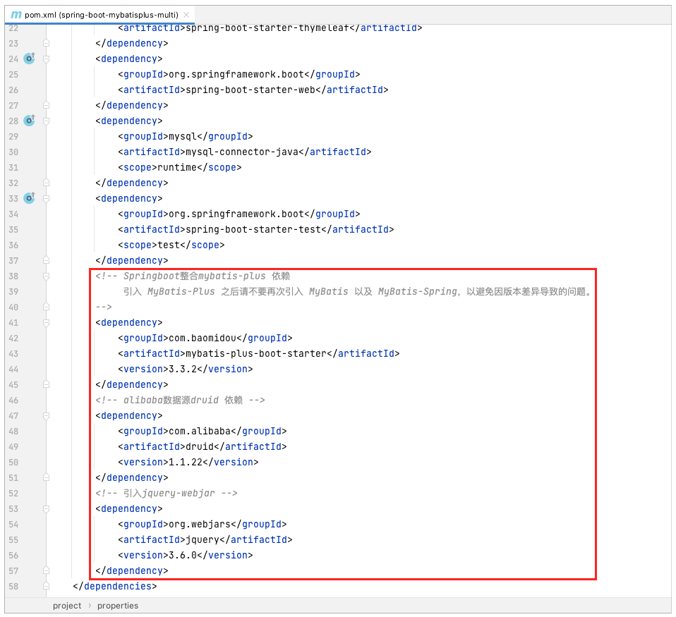
```xml
<!-- Springboot整合mybatis-plus 依赖
    引入 MyBatis-Plus 之后请不要再次引入 MyBatis 以及 MyBatis-Spring，以避免因版本差异导致的问题。
-->
<dependency>
    <groupId>com.baomidou</groupId>
    <artifactId>mybatis-plus-boot-starter</artifactId>
    <version>3.3.2</version>
</dependency>
<!-- alibaba数据源druid 依赖 -->
<dependency>
    <groupId>com.alibaba</groupId>
    <artifactId>druid</artifactId>
    <version>1.1.22</version>
</dependency>
<!-- 引入jquery-webjar -->
<dependency>
    <groupId>org.webjars</groupId>
    <artifactId>jquery</artifactId>
    <version>3.6.0</version>
</dependency>
```

4、在SpringBoot的yml配置文件中，配置连接MySQL数据库
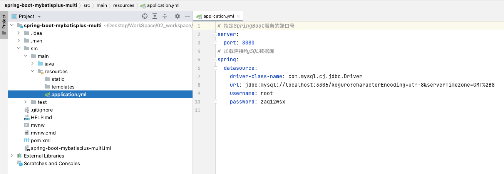
```yml
# 指定SpringBoot服务的端口号
server:
  port: 8080
# 加载连接MySQL数据库
spring:
  datasource:
    driver-class-name: com.mysql.cj.jdbc.Driver
    url: jdbc:mysql://localhost:3306/koguro?characterEncoding=utf-8&serverTimezone=GMT%2B8
    username: root
    password: zaq12wsx
```

5、创建User和Work的Entity
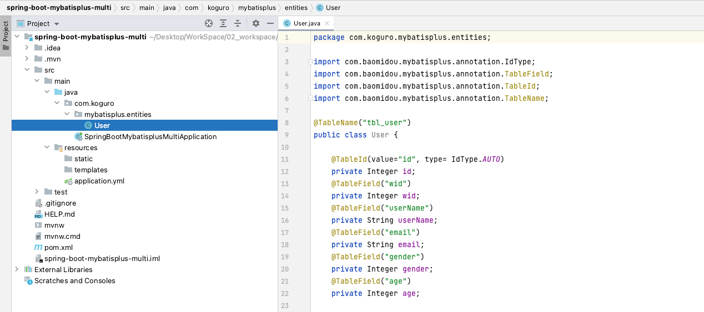
```java
package com.koguro.mybatisplus.entities;

import com.baomidou.mybatisplus.annotation.IdType;
import com.baomidou.mybatisplus.annotation.TableField;
import com.baomidou.mybatisplus.annotation.TableId;
import com.baomidou.mybatisplus.annotation.TableName;

@TableName("tbl_user")
public class User {

    @TableId(value="id", type= IdType.AUTO)
    private Integer id;
    @TableField("wid")
    private Integer wid;
    @TableField("userName")
    private String userName;
    @TableField("email")
    private String email;
    @TableField("gender")
    private Integer gender;
    @TableField("age")
    private Integer age;

    public Integer getId() {
        return id;
    }

    public void setId(Integer id) {
        this.id = id;
    }

    public Integer getWid() {
        return wid;
    }

    public void setWid(Integer wid) {
        this.wid = wid;
    }

    public String getUserName() {
        return userName;
    }

    public void setUserName(String userName) {
        this.userName = userName;
    }

    public String getEmail() {
        return email;
    }

    public void setEmail(String email) {
        this.email = email;
    }

    public Integer getGender() {
        return gender;
    }

    public void setGender(Integer gender) {
        this.gender = gender;
    }

    public Integer getAge() {
        return age;
    }

    public void setAge(Integer age) {
        this.age = age;
    }
}
```
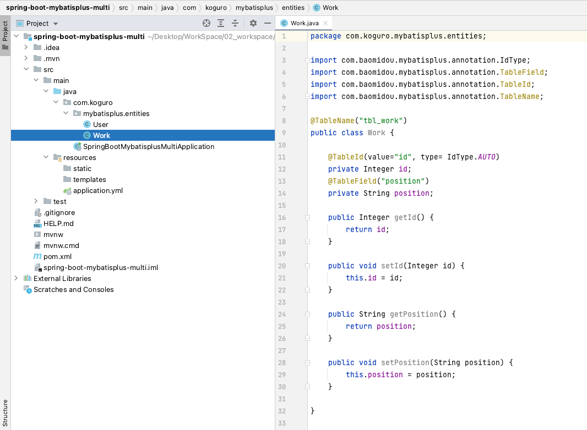
```java
package com.koguro.mybatisplus.entities;

import com.baomidou.mybatisplus.annotation.IdType;
import com.baomidou.mybatisplus.annotation.TableField;
import com.baomidou.mybatisplus.annotation.TableId;
import com.baomidou.mybatisplus.annotation.TableName;

@TableName("tbl_work")
public class Work {
    
    @TableId(value="id", type= IdType.AUTO)
    private Integer id;
    @TableField("position")
    private String position;

    public Integer getId() {
        return id;
    }

    public void setId(Integer id) {
        this.id = id;
    }

    public String getPosition() {
        return position;
    }

    public void setPosition(String position) {
        this.position = position;
    }
    
}
```

6、通过建立实体类关系方式查询
User表实体应该包含Work表实体的对象引用。需要在User实体类中增加一个work属性即可，并生成对应的getter和setter方法。
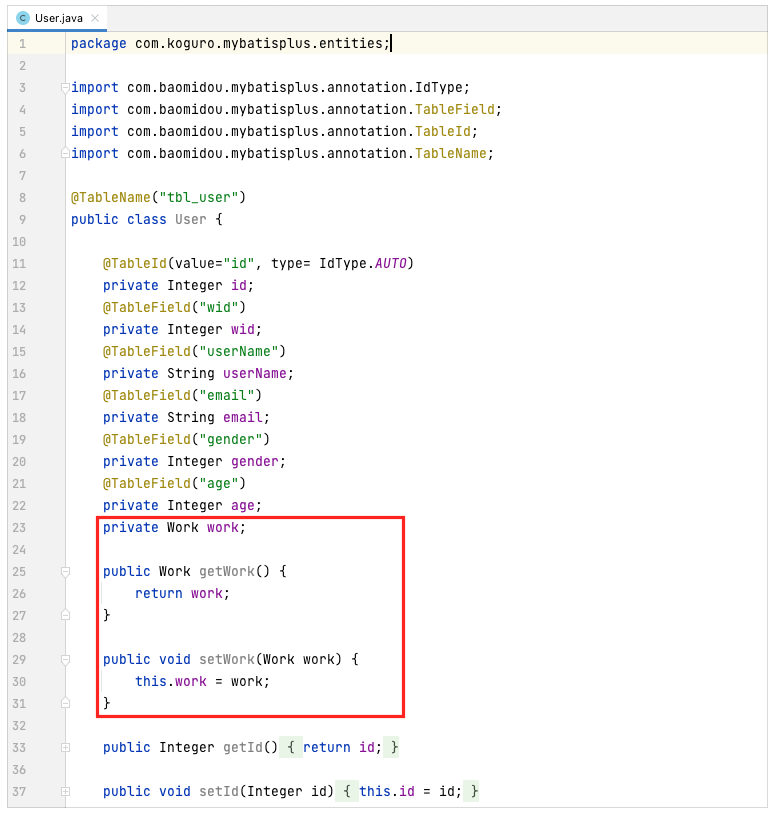
```java
/* 添加的Work属性 */
private Work work;

public Work getWork() {
    return work;
}

public void setWork(Work work) {
    this.work = work;
}
```

7、创建UserWorkMapper接口类，进行查询处理。
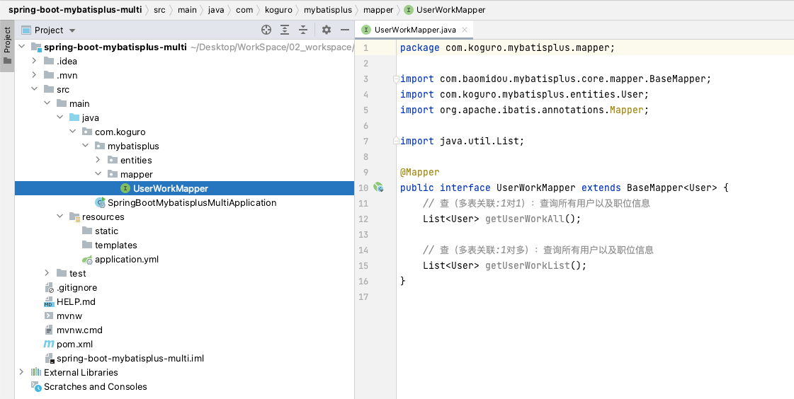
```java
package com.koguro.mybatisplus.mapper;

import com.baomidou.mybatisplus.core.mapper.BaseMapper;
import com.koguro.mybatisplus.entities.User;
import org.apache.ibatis.annotations.Mapper;

import java.util.List;

@Mapper
public interface UserWorkMapper extends BaseMapper<User> {
    // 查（多表关联:1对1）：查询所有用户以及职位信息
    List<User> getUserWorkAll();

    // 查（多表关联:1对多）：查询所有用户以及职位信息
    List<User> getUserWorkList();
}
```

8、创建Controller执行查询数据（UserWorkController.java）
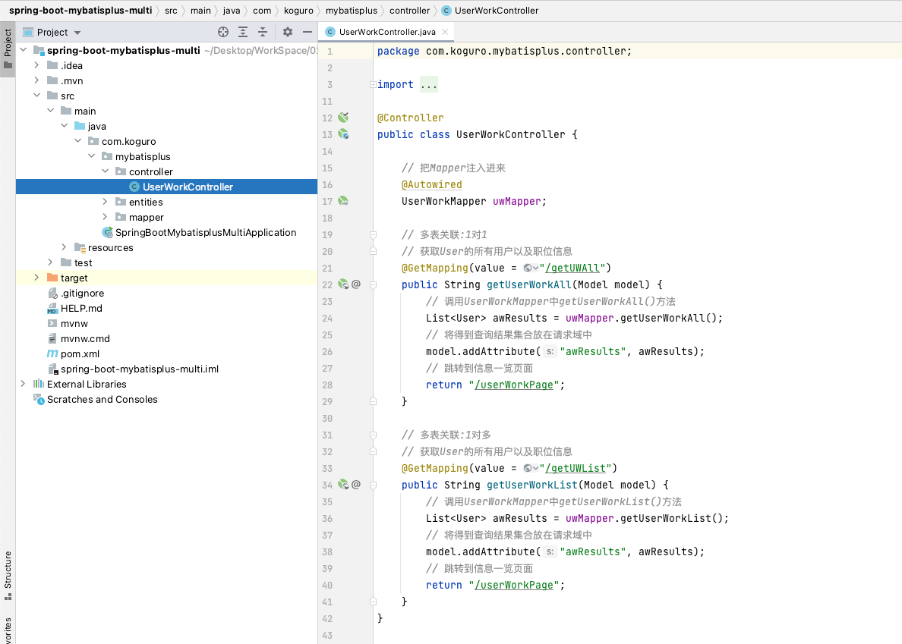
```java
package com.koguro.mybatisplus.controller;

import com.koguro.mybatisplus.entities.User;
import com.koguro.mybatisplus.mapper.UserWorkMapper;
import org.springframework.beans.factory.annotation.Autowired;
import org.springframework.stereotype.Controller;
import org.springframework.ui.Model;
import org.springframework.web.bind.annotation.GetMapping;

import java.util.List;

@Controller
public class UserWorkController {

    // 把Mapper注入进来
    @Autowired(required=false)
    UserWorkMapper uwMapper;

    // 多表关联:1对1
    // 获取User的所有用户以及职位信息
    @GetMapping(value = "/getUWAll")
    public String getUserWorkAll(Model model) {
        // 调用UserWorkMapper中getUserWorkAll()方法
        List<User> awResults = uwMapper.getUserWorkAll();
        // 将得到查询结果集合放在请求域中
        model.addAttribute("awResults", awResults);
        // 跳转到信息一览页面
        return "/userWorkPage";
    }

    // 多表关联:1对多
    // 获取User的所有用户以及职位信息
    @GetMapping(value = "/getUWList")
    public String getUserWorkList(Model model) {
        // 调用UserWorkMapper中getUserWorkList()方法
        List<User> awResults = uwMapper.getUserWorkList();
        // 将得到查询结果集合放在请求域中
        model.addAttribute("awResults", awResults);
        // 跳转到信息一览页面
        return "/userWorkPage";
    }

}
```

9、创建一个映射文件，用于实现SQL文（UserWorkMapper.xml）
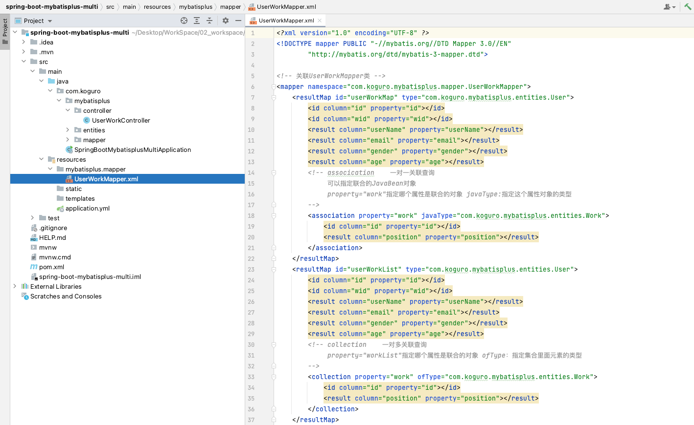
```xml
<?xml version="1.0" encoding="UTF-8" ?>
<!DOCTYPE mapper PUBLIC "-//mybatis.org//DTD Mapper 3.0//EN"
        "http://mybatis.org/dtd/mybatis-3-mapper.dtd">

<!-- 关联UserWorkMapper类 -->
<mapper namespace="com.koguro.mybatisplus.mapper.UserWorkMapper">
    <resultMap id="userWorkMap" type="com.koguro.mybatisplus.entities.User">
        <id column="id" property="id"></id>
        <id column="wid" property="wid"></id>
        <result column="userName" property="userName"></result>
        <result column="email" property="email"></result>
        <result column="gender" property="gender"></result>
        <result column="age" property="age"></result>
        <!-- assocication    一对一关联查询
             可以指定联合的JavaBean对象
             property="work"指定哪个属性是联合的对象 javaType:指定这个属性对象的类型
        -->
        <association property="work" javaType="com.koguro.mybatisplus.entities.Work">
            <id column="id" property="id"></id>
            <result column="position" property="position"></result>
        </association>
    </resultMap>
    <resultMap id="userWorkList" type="com.koguro.mybatisplus.entities.User">
        <id column="id" property="id"></id>
        <id column="wid" property="wid"></id>
        <result column="userName" property="userName"></result>
        <result column="email" property="email"></result>
        <result column="gender" property="gender"></result>
        <result column="age" property="age"></result>
        <!-- collection    一对多关联查询
		     property="workList"指定哪个属性是联合的对象 ofType：指定集合里面元素的类型
		-->
        <collection property="work" ofType="com.koguro.mybatisplus.entities.Work">
            <id column="id" property="id"></id>
            <result column="position" property="position"></result>
        </collection>
    </resultMap>

    <!-- 关联查询UserWork信息方法 -->
    <select id="getUserWorkAll" resultMap="userWorkMap">
        select u.*, w.* from tbl_user u LEFT JOIN tbl_work w on u.wid = w.id
    </select>

    <select id="getUserWorkList" resultMap="userWorkList">
        select u.*, w.* from tbl_user u LEFT JOIN tbl_work w on u.wid = w.id
    </select>
</mapper>
```

10、修改数据的配置文件「application.yml」文件，加载mybatis映射文件
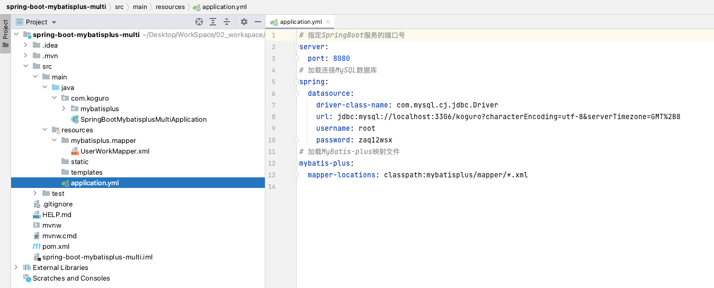
```yml
# 加载MyBatis-plus映射文件
mybatis-plus:
  mapper-locations: classpath:mybatisplus/mapper/*.xml
```

11、创建查询结果显示画面（userWorkPage.html）
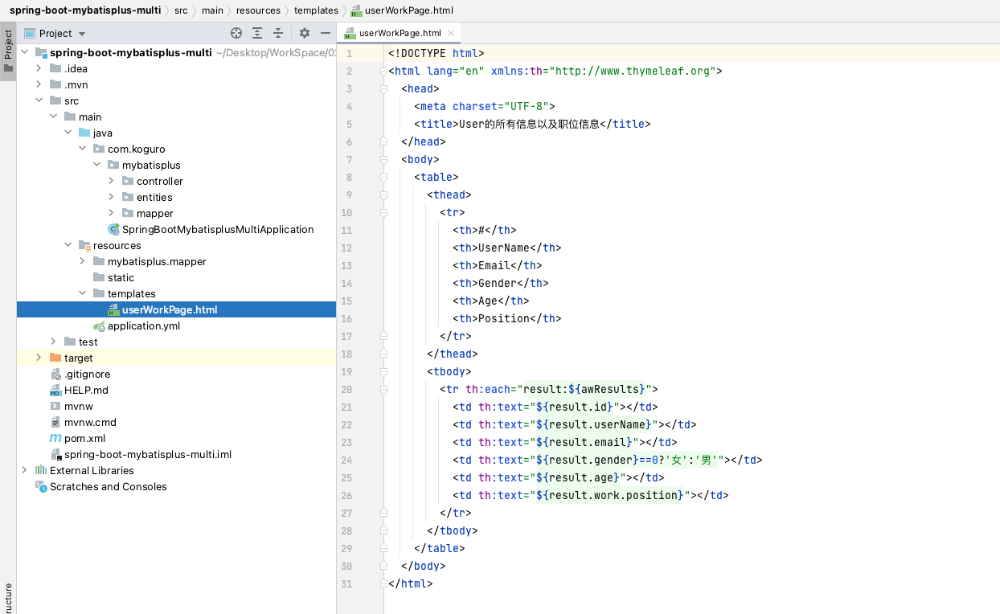
```html
<!DOCTYPE html>
<html lang="en" xmlns:th="http://www.thymeleaf.org">
  <head>
    <meta charset="UTF-8">
    <title>User的所有信息以及职位信息</title>
  </head>
  <body>
    <table>
      <thead>
        <tr>
          <th>#</th>
          <th>UserName</th>
          <th>Email</th>
          <th>Gender</th>
          <th>Age</th>
          <th>Position</th>
        </tr>
      </thead>
      <tbody>
        <tr th:each="result:${awResults}">
          <td th:text="${result.id}"></td>
          <td th:text="${result.userName}"></td>
          <td th:text="${result.email}"></td>
          <td th:text="${result.gender}==0?'女':'男'"></td>
          <td th:text="${result.age}"></td>
          <td th:text="${result.work.position}"></td>
        </tr>
      </tbody>
    </table>
  </body>
</html>
```

## 测试查询功能(1对1)
访问查询地址，执行查询功能
```
http://localhost:8080/getUWAll
```
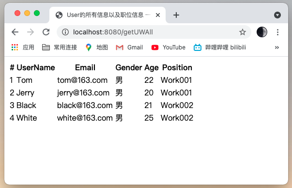

## 测试查询功能(1对多)
访问查询地址，执行查询功能
```
http://localhost:8080/getUWList
```
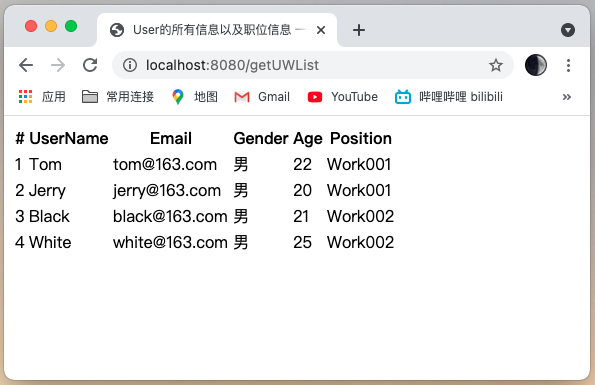

# End