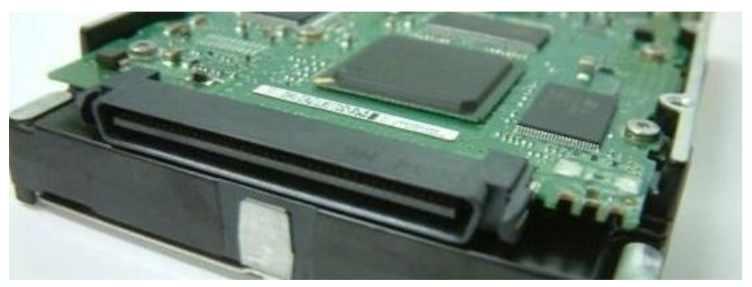
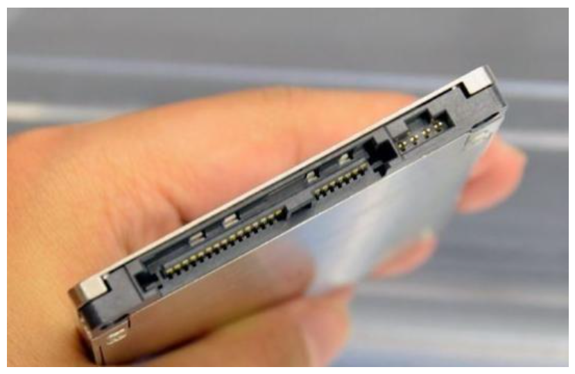

# HardDisk 的基础知识

## 硬盘生成商
1、希捷（Seagate）
希捷公司成立于1980年，现为全球第1大的硬盘、磁盘和读写磁头制造商，希捷在设计、制造和销售硬盘领域居全球领先地位，提供用于企业、台式电脑、移动设备和消费电子的产品。2005年并购迈拓（Maxtor）2011年4月-2011年12月 收购三星（Samsung）旗下的硬盘业务后成为最大的硬盘厂商。

2、西部数据（Western Digital）
西部数据是全球知名的硬盘厂商，现为全球第2大硬盘制造商，成立于1979年，总部位于美国加州，在世界各地设有分公司或办事处，为全球五大洲用户提供存储器产品，2011年3月收购日立。

3、日立（HITACHI）
HITACHI日立集团是全球最大的综合跨国集团之一，台式电脑硬盘，笔记本硬盘都有生产。于2002年并购IBM硬盘生产事业部门。于2011年3月被西部数据收购。

4、东芝（TOSHIBA）
日本最大的半导体制造商，亦是第二大综合电机制造商，隶属于三井集团旗下。　主要生产移动存储产品。

5、三星（Samsung）
韩国最大的企业集团三星集团的简称。生产的硬盘提供用于台式电脑、移动设备和消费电子的产品。2011年4月19日，希捷正式宣布以13.75亿美元（现金加股票的方式）收购三星硬盘业务。2011年12月20日，希捷宣布已完成对三星电子有限公司旗下硬盘业务的收购交易。

## 硬盘种类
1、固态硬盘（SSD）：采用闪存颗粒来储存
2、机械硬盘（HDD）：采用磁性碟片来储存
3、混合硬盘（HHD）：是把磁性硬盘和闪存集成到一起的一种硬盘

## 硬盘接口
1、IDE接口硬盘：
IDE是Integrated Drive Electronics的缩写，有着价格低廉，兼容性强，性价比高，数据传输慢，不支持热插拔的特点。在实际的应用中，人们也习惯用IDE来称呼最早出现IDE类型硬盘ATA-1，这种类型的接口随着接口技术的发展已经被淘汰了，而其后发展分支出更多类型的硬盘接口，比如ATA、Ultra ATA、DMA、Ultra DMA等接口都属于IDE硬盘。

2、SCSI接口硬盘
SCSI是Small Computer System Interface的缩写，拥有传输速率高、读写性能好、可连接多个设备、可支持热插拔、价格比较贵的特点。SCSI接口硬盘主要应用于中、高端服务器和高档工作站中。

3、SATA接口硬盘
SATA是Serial Advanced Technology Attachment的缩写，SATA采用串行连接方式，串行ATA总线使用嵌入式时钟信号，具备了更强的纠错能力，与以往相比其最大的区别在于能对传输指令（不仅仅是数据）进行检查，如果发现错误会自动矫正，这在很大程度上提高了数据传输的可靠性。

4、SAS接口硬盘
SAS 是Serial Attached SCSI的缩写，即串行连接SCSI。和现在流行的Serial ATA（SATA）硬盘相同，都是采用串行技术以获得更高的传输速度，并通过缩短连结线改善内部空间。SAS是新一代的SCSI技术。SAS是并行SCSI接口之后开发出的全新接口。此接口的设计是为了改善存储系统的效能、可用性和扩充性，提供与串行ATA （Serial ATA，缩写为SATA）硬盘的兼容性。

5、光纤通道
光线通过类型硬盘的英文名称为Fibre Channel，其最初设计也不是为了硬盘设计开发的接口，是专门为网络系统设计的，但随着存储系统对速度的需求，才逐渐应用到硬盘系统中。光纤通道的主要特性有：热插拔性、高速带宽、远程连接、连接设备数量大等。

## 硬盘应用场景
1、希捷（Seagate）

酷狼
Seagate IronWolf: For NAS Environments
酷狼硬盘适用于个人家庭NAS系统或小型企业的小型文件服务器/NAS系统。
酷狼Pro硬盘应用于多盘位服务器上，最多支持16盘位组合托架，可7*24小时不间断工作，所以它的性能必须特别可靠，质量必须特别过关，酷狼Pro标配了RV旋转振动传感器(可更有效应对多盘位环境震动，保持硬盘最佳工作状态)，硬盘的工作负载评级限制 (WRL) 是 300TB/年，平均故障间隔时间 (MTBF) 120 万小时。一般情况下，普通NAS盘的质保期是两三年左右，酷狼Pro是五年，而且它提供2年希捷独有的 Rescue +数据恢复服务，确保数据更加安全。
IronWolf Logo

Seagate 16TB IronWolf 7200 rpm SATA III 3.5" Internal NAS HDD (CMR, Retail)

Seagate 16TB IronWolf Pro 7200 rpm SATA III 3.5" Internal NAS HDD (CMR, Retail)

Seagate 3.84TB IronWolf 110 SATA III 2.5" Internal SSD

Seagate 240GB IronWolf 510 M.2 PCIe NVMe Internal SSD

酷鱼
Seagate BarraCuda: Versatile and Dependable
酷鱼系列，从一代开始到5代分别为Barracuda(酷鱼一代)、Barracuda II(酷鱼 二)、Barracuda III(酷鱼 三)系列、Barracuda IV(酷鱼 四)系列、Barracuda V(酷鱼 五)系列。自从酷鱼五以来，希捷酷鱼系列的硬盘的安静就是出了名的，而7200.7继续秉承了这一传统。
BarraCuda Logo

Seagate 2TB BarraCuda 5400 rpm SATA 2.5" Internal HDD

Seagate 14TB BarraCuda Pro 7200 rpm SATA III 3.5" Internal HDD (Retail)

Seagate 2TB BarraCuda 120 SATA III 2.5" Internal SSD

Seagate 250GB BarraCuda 510 M.2 PCIe NVMe Internal SSD

酷鹰
Seagate SkyHawk: Build a Surveillance System
希捷在安防监控行业拥有10年的技术积累，推出了安防界第一块监控硬盘。通过与海康威视、大华股份、宇视科技等多家安防企业进行技术合作，研发专用于安防监控领域的监控硬盘和解决方案，现已全面支持安防核心行业应用(公安，金融，楼宇，智能交通，平安城市等等)希捷监控卫士---“酷鹰”全新升级优化，带来全新体验---敏捷、安全、放心。
SkyHawk Logo

Seagate 10TB SkyHawk Surveillance SATA III 3.5" Internal Hard Drive (Retail)

Seagate 16TB SkyHawk AI 7200 rpm SATA III 3.5" Internal Surveillance HDD

酷玩
Seagate FireCuda: Built for Gaming
酷玩游戏硬盘。痛恨游戏或应用的漫长加载时间？相比标准硬盘而言，FireCuda 拥有更出色的性能，并像您对硬盘解决方案期待的那样，提供大容量选项。这是游戏玩家、创意专业人士和计算机爱好者们的理想升级选择。
FireCuda Logo

Seagate 2TB FireCuda 2.5" Internal Hybrid Drive

Seagate 1TB FireCuda 3.5" Internal Hybrid Drive

Seagate 2TB FireCuda 510 M.2 PCIe NVMe Internal SSD

Seagate 1TB FireCuda 520 M.2 Internal SSD

Exos X 企业级硬盘
Seagate Exos X 系列企业级硬盘专为处理严苛的工作负荷而设计，对于服务器、存储系统和以业务为中心的 NAS 系统而言，是高可靠性的理想解决方案。无论是何种用途，都有一款 Exos 硬盘可以满足您的需求。
Seagate Exos X: For Hyperscale Enterprise Environments
Exos X Logo

Seagate 16TB Exos X16 7200 rpm SATA III 3.5" Internal HDD

2、西部数据（Western Digital）

西部数据黑盘
黑色硬盘的代号为LSWDCaviarBlack，它内部使用高性能的电子结构架设，机械结构严密，功耗低，在硬盘运行过程中不会过热、无接触磁头和振动保护保证数据安全，具有存储空间大、稳定度高、缓存大的特点，适合企业和服务器、全装备游戏型、多媒体剪辑型等高端计算机。

西部数据蓝盘
蓝色硬盘的代号为KSWDCaviarBlue，它与其他颜色硬盘相比，整体性能较为平衡，并且使用寿命更长。如果说黑盘是高端路线，那么蓝盘就是平民路线，西数蓝盘的价格实惠、功耗更小，适合一般家庭和个人使用。西数蓝盘具有高速缓存容量，外部设有SATA和PATA接口，保证了其强力的性能，自带防震、错误修复与数据保护功能，提高了硬盘的稳定度和安全性。

西部数据绿盘
西数绿盘属于环保型硬盘，一般来说，硬盘容量增加，需要耗费的电量也逐步增大。而西数绿盘则更低碳环保，它超静音运行、更为省电、低温、它在高硬盘容量和稳定性的前提下，比普通台式机的硬盘功耗低40%，耗电量降低4-5瓦。

西部数据红盘
红盘主要针对NAS用户，适合小型企业和家庭，整体性能于绿盘接近，噪音小、功耗低、可以保证长时间的稳定工作，使用专 门 的NASware技术，让硬盘兼容性更高。

西部数据紫盘
紫盘是西部数据发布的最新硬盘，它主要针对视频监控数据存储的应用，为了监控兼容测试等服务，可以同时支持八块硬盘并行，接入32个高清摄像头同时运作，最大保证每年存储数据量达到60TB，适用于个人和小型企业等用户。西数紫盘传输速度比不上黑盘，但稳定度较高，容量较大。

3、三星（Samsung）

# End